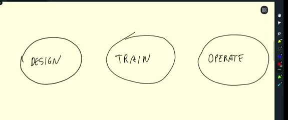

# Introduction

MLOps is the set of practices we use to put machine learning into production. We use a taxi ride duration model throughout the course. It gives us one problem to follow from the first experiment to a running service.

## From a question to a prediction

We start by predicting taxi ride duration. A passenger supplies a pickup and drop-off location, and our model predicts the trip duration.

The prediction is useful only when another application can call it. We expose the model through an API, send the trip information to that API, and return an estimated duration.

## Design, train, and operate

The course describes the work in three broad stages.

- During design, we decide whether machine learning is the right tool for the problem.
- During training, we prepare data, run experiments, and choose a model.
- During operation, we deploy the model, serve new requests, and check that its performance stays useful.

MLOps connects these stages through experiment tracking, deployment, and monitoring. Tracking helps us reproduce a result, deployment makes the model available to other systems, and monitoring tells us when the data or model needs attention.
