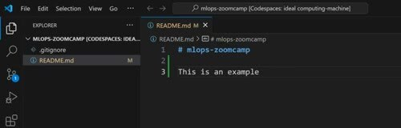
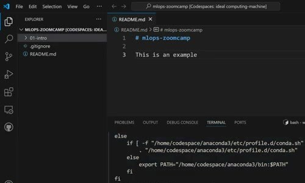
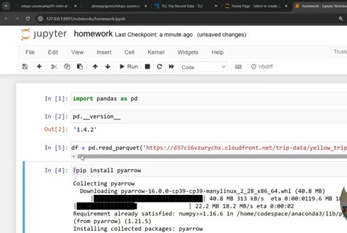

# GitHub Codespaces

GitHub Codespaces gives us a ready-to-use development machine in the cloud. It's an alternative to installing Linux, Docker, and the course tools on your own computer.

## Create the workspace

Create a public GitHub repository for your course work. The repository needs to be public because you'll later submit a link to your homework. Add a README and the Python `.gitignore` template, then create the repository.



Open the repository's Code menu, select the Codespaces tab, and create a codespace from the `main` branch. GitHub starts a browser version of Visual Studio Code with a terminal, the repository, and Docker already available.

## Check the prepared tools

Run the Docker smoke test from the integrated terminal:

```bash
docker run hello-world
```



Codespaces saves the setup work from the longer VM instructions. You don't need to install Docker or Docker Compose again inside the codespace.

## Use the desktop editor when you need forwarded ports

The browser editor is enough for many commands, but notebooks and MLflow need a way to expose their ports. Open the codespace in the desktop version of Visual Studio Code when you need to connect to Jupyter or another service from your computer.


