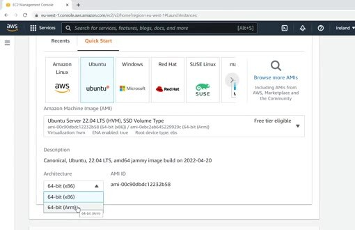
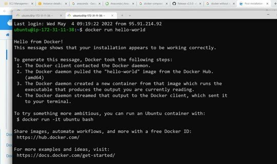

# VM in AWS

You can use your local computer, GitHub Codespaces, or another cloud provider. Here we set up one AWS EC2 machine. We recommend Linux because the course tools and commands are easiest to reproduce there.

## Create an EC2 instance

Open EC2 and launch an instance. Choose Ubuntu and prefer the x86 architecture for this course because some tools may not work on ARM. Pick an instance with enough memory for notebooks, Docker, and MLflow. A small free-tier instance may not be sufficient.



Create or select a key pair. Download the private key and keep it in your local `.ssh` directory. Protect the file before you use it.

Run this command before you use the key:

```bash
chmod 400 name-of-your-private-key-file.pem
```


Connect to the instance over SSH, then install the development tools. The original walkthrough uses Anaconda, Ubuntu packages, and Docker.

## Install Docker

Install Docker from the official Ubuntu repository:

```bash
wget https://repo.anaconda.com/archive/Anaconda3-2022.05-Linux-x86_64.sh
bash Anaconda3-2022.05-Linux-x86_64.sh

sudo apt-get update
sudo apt-get install ca-certificates curl
sudo install -m 0755 -d /etc/apt/keyrings
sudo curl -fsSL https://download.docker.com/linux/ubuntu/gpg -o /etc/apt/keyrings/docker.asc
sudo chmod a+r /etc/apt/keyrings/docker.asc

sudo apt-get install docker-ce docker-ce-cli containerd.io docker-buildx-plugin docker-compose-plugin
sudo groupadd docker
sudo usermod -aG docker $USER
```

Restart the session if Docker still requires `sudo`, then verify the installation:

```bash
docker run hello-world
```



If the Docker daemon isn't running, start it with `sudo dockerd` or restart the instance. You can use the same commands on a local Linux machine, so the cloud VM is an option rather than a requirement.
