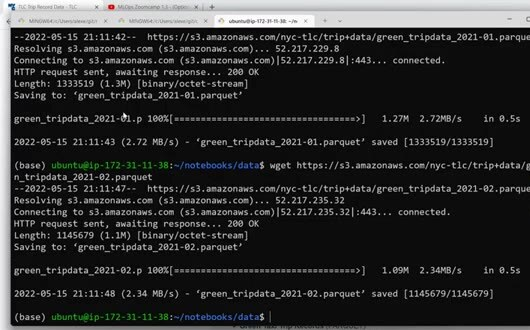
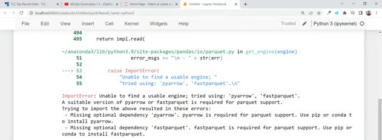
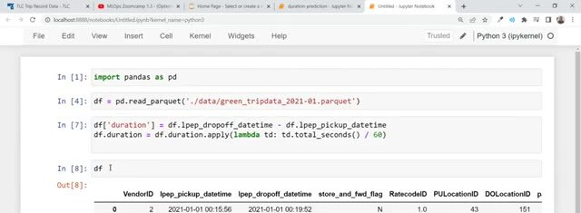

# Reading Parquet Data

The NYC taxi dataset used in the training lesson moved from CSV to Parquet. Parquet files are smaller and preserve column types, but we need a Parquet engine before pandas can read them.

## Download the files

Download the January and February files into the data directory:

```bash
wget https://d37ci6vzurychx.cloudfront.net/trip-data/yellow_tripdata_2021-01.parquet
wget https://d37ci6vzurychx.cloudfront.net/trip-data/yellow_tripdata_2021-02.parquet
```



## Install a Parquet engine

Install `pyarrow` or `fastparquet` so pandas can read Parquet files.

In the notebook, use `pyarrow` with this command:

```python
!pip install pyarrow
```

Without `pyarrow` or `fastparquet`, `pandas.read_parquet` reports that it can't find a usable engine.



## Read the data

Read the file with `read_parquet` instead of `read_csv`:

```python
import pandas as pd

df = pd.read_parquet('data/green_tripdata_2021-01.parquet')
```

Parquet already stores the pickup and drop-off timestamps with datetime information. The later training notebook doesn't need the same string-parsing step used by the older CSV version.


