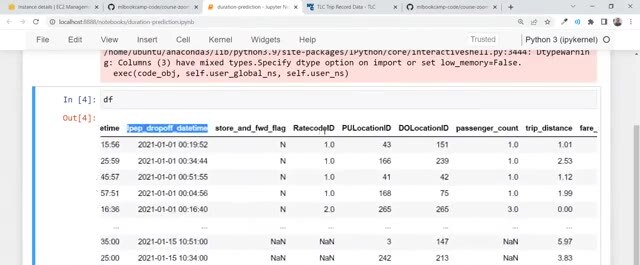
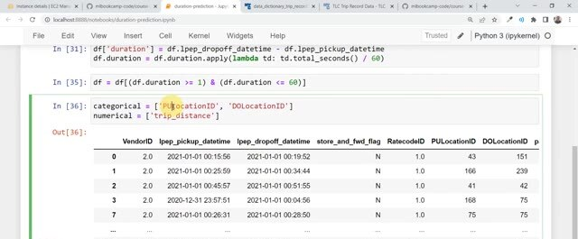
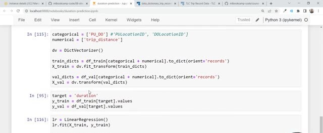

# Training a Ride Duration Prediction Model

This optional walkthrough builds the first version of the taxi ride duration model. You can look at the final notebook without watching the whole recording. The sequence is useful because later modules turn this notebook into a tracked, repeatable, and deployable workflow.

## Load and prepare the data

Load the January and February 2021 taxi data with pandas. We use January for training and February for validation. The columns include pickup and drop-off timestamps, location IDs, trip distance, and passenger information.



Calculate the target by subtracting pickup time from drop-off time. Convert the resulting `timedelta` to minutes, then keep a reasonable duration range so extreme records don't dominate the model.

```python
df['duration'] = (
    df['lpep_dropoff_datetime'] - df['lpep_pickup_datetime']
).dt.total_seconds() / 60
```

## Build the feature matrix

For the first iteration, use pickup location, drop-off location, and trip distance. Treat the location IDs as categorical features and the distance as a numerical feature. Convert each row into a dictionary and use `DictVectorizer` to create the feature matrix.



```python
categorical = ['PULocationID', 'DOLocationID']
numerical = ['trip_distance']

train_dicts = df[categorical + numerical].to_dict(orient='records')
dv = DictVectorizer()
X_train = dv.fit_transform(train_dicts)
```

The vectorizer one-hot encodes the location IDs and keeps trip distance as a numerical feature. We fit the vectorizer on training data and later call `transform` on validation data so both matrices use the same feature columns.

## Train and evaluate a baseline

Fit a linear regression model and measure its error with root mean squared error. The recorded example gets a training error of roughly nine minutes and a validation error of roughly ten minutes. That gives us a baseline to improve in later modules.

```python
from sklearn.linear_model import LinearRegression
from sklearn.metrics import mean_squared_error

model = LinearRegression()
model.fit(X_train, y_train)
y_pred = model.predict(X_val)
rmse = mean_squared_error(y_val, y_pred, squared=False)
```



We also try Lasso regression and vary its `alpha` value to compare models. Without recording the run history, it's hard to remember which model produced each result. Module 2 adds that history with MLflow.
