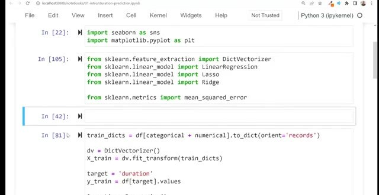
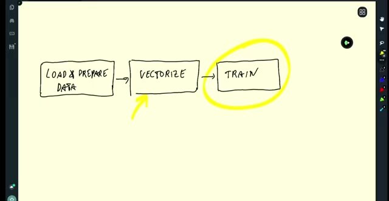
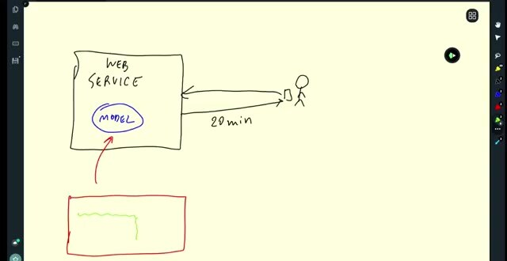

# Course Overview

The course starts with the taxi duration notebook and gradually turns it into an MLOps system. Each module removes a different source of manual work while keeping the same prediction problem in view.

## The path through the course

We follow this path through the modules:

- Module 1 introduces the project, prepares the environment, and establishes a baseline model.
- Module 2 adds experiment tracking and model management with MLflow.
- Module 3 turns notebook cells into a training script and introduces pipeline orchestration.
- Module 4 serves the model in batch, online, and streaming modes.
- Module 5 monitors data and model behavior after deployment.
- Module 6 adds tests, code quality checks, infrastructure as code, and CI/CD.

## Moving beyond the notebook

We start with useful code in the notebook, but it's easy to run cells in the wrong order. Exploratory cells can remain behind, and earlier experiment history can disappear.

We make the steps explicit so we can run them again for another month of data. We can then compare the resulting models and save the model that should be served.

Once we package the model, another service can call it instead of opening the notebook. Later modules add tracking, deployment, monitoring, and engineering practices. These practices make the service maintainable.

