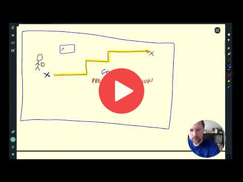
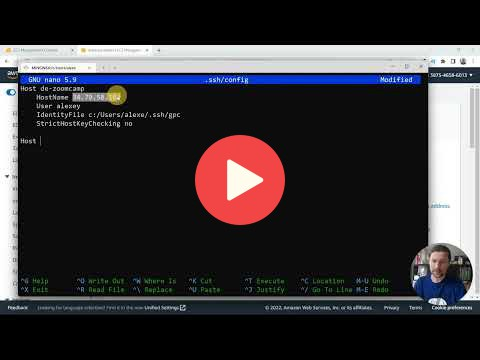
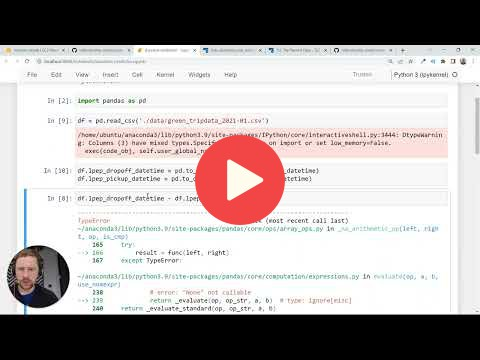
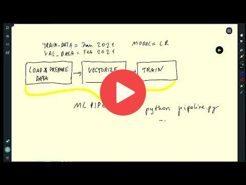
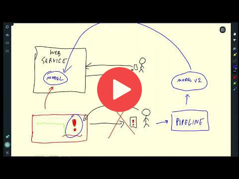

# 1. Introduction

Instructor: Alexey Grigorev

## 1.1 Introduction

<a href="https://www.youtube.com/watch?v=s0uaFZSzwfI&list=PL3MmuxUbc_hIUISrluw_A7wDSmfOhErJK">
  
</a>


## 1.2 Environment preparation

**Note**: You don't have to rent an instance in the cloud. You can follow the same instructions 
for setting up your local environment. 

<a href="https://www.youtube.com/watch?v=IXSiYkP23zo&list=PL3MmuxUbc_hIUISrluw_A7wDSmfOhErJK">
  
</a>


Code:

Recommended development environment: Linux

### Step 1: Download and install the Anaconda distribution of Python
```sh
wget https://repo.anaconda.com/archive/Anaconda3-2022.05-Linux-x86_64.sh
bash Anaconda3-2022.05-Linux-x86_64.sh
```

### Step 2: Update existing packages

```sh
sudo apt update
```

### Step 3: Install Docker

```sh
sudo apt install docker.io
```

To run docker without `sudo`:

```sh
sudo groupadd docker
sudo usermod -aG docker $USER
```

### Step 4: Install Docker Compose

Install docker-compose in a separate directory

```sh
mkdir soft
cd soft
```

To get the latest release of Docker Compose, go to https://github.com/docker/compose and download the release for your OS.

```sh
wget https://github.com/docker/compose/releases/download/v2.5.0/docker-compose-linux-x86_64 -O docker-compose
```

Make it executable

```sh
chmod +x docker-compose
```

Add to the `soft` directory to `PATH`. Open the `.bashrc` file with `nano`:

```sh
nano ~/.bashrc
```

In `.bashrc`, add the following line:

```bash
export PATH="${HOME}/soft:${PATH}"
```

Save it and run the following to make sure the changes are applied:

```bash
source ~/.bashrc
```


### Step 5: Run Docker

```sh
docker run hello-world
```

If you get `docker: Got permission denied while trying to connect to the Docker daemon socket at unix:///var/run/docker.sock: Post "http://%2Fvar%2Frun%2Fdocker.sock/v1.24/containers/create": dial unix /var/run/docker.sock: connect: permission denied.` error, restart your VM instance. 


**Note**: If you get `It is required that your private key files are NOT accessible by others. This private key will be ignored.` error, you should change permits on the downloaded file to protect your private key:

 ```sh
chmod 400 name-of-your-private-key-file.pem
```

## 1.3 (Optional) Training a ride duration prediction model

**Note**: The NYC taxi data is now in parquet format, not CSV.
Here's a [video](https://www.youtube.com/watch?v=r94QjpX9vSE&list=PL3MmuxUbc_hIUISrluw_A7wDSmfOhErJK) that explains how to 
read parquet data.

<a href="https://www.youtube.com/watch?v=iRunifGSHFc&list=PL3MmuxUbc_hIUISrluw_A7wDSmfOhErJK">
  
</a>

Links:

* [Notebook](duration-prediction.ipynb)


## 1.4 Course overview

<a href="https://www.youtube.com/watch?v=teP9KWkP6SM&list=PL3MmuxUbc_hIUISrluw_A7wDSmfOhErJK">
  
</a>


## 1.5 MLOps maturity model

<a href="https://www.youtube.com/watch?v=XwTH8BDGzYk&list=PL3MmuxUbc_hIUISrluw_A7wDSmfOhErJK">
  
</a>

Links: 

* [MLOps Maturity model](https://docs.microsoft.com/en-us/azure/architecture/example-scenario/mlops/mlops-maturity-model)


## 1.6 Homework

More information [here](../cohorts/2023/01-intro/homework.md).


## Notes

Did you take notes? Add them here:

* [Local MacOS envprep by Adetbekov](https://github.com/adetbekov/mlops-zoomcamp/blob/main/01-intro/macos-local-envprep.md)
* [Environment Setup by Ayoub](https://github.com/ayoub-berdeddouch/mlops-journey/blob/main/intro-01.md)
* [Intro, Environment Setup, and MLOps Maturity Models by Bala](https://github.com/balapriyac/DTC-MLOps-Zoomcamp/tree/main/week1)
* [GCP Environment Setup by Piyush](https://github.com/piyush-an/MLOps-ZoomCamp/blob/main/01-Introduction/infrastructure.md)
* [Microsoft Azure Environment Setup by Olaide](https://github.com/josepholaide/MLOps-Practice/blob/main/Week%201/README.md)
* [Environment Preparation using GCP and pyenv by Dani](https://github.com/syahrulhamdani/dtc-mlops/blob/main/week-1-introduction/README.md)
* [Useful links by Zioalex](https://github.com/zioalex/mlops-zoomcamp/blob/main/My_notes_week1.md)
* [Notes by Alvaro Navas](https://github.com/ziritrion/mlopszoomcamp/blob/main/notes/1_intro.md)
  * [Environment setup on GCP (recycled from Data Engineering Zoomcamp)](https://gist.github.com/ziritrion/3214aa570e15ae09bf72c4587cb9d686)
  * [Docker cheatsheet](https://gist.github.com/ziritrion/1842c8a4c4851602a8733bba19ab6050)
  * [Conda cheatsheet](https://gist.github.com/ziritrion/8024025672ea92b8bdeb320d6015aa0d)
  * [Git cheatsheet](https://gist.github.com/ziritrion/d73ca65bf4d19c79ca842a55853cb962)
  * [Python and data libraries cheatseet](https://gist.github.com/ziritrion/9b80e47956adc0f20ecce209d494cd0a)
* [Cloud server setup using Deploifai (on AWS, Azure, or GCP) by 98sean98](https://github.com/98sean98/mlops-zoomcamp/blob/main/01-intro/deploifai-server/readme.md)
* [Notes from first lesson by Neimv](https://gitlab.com/neimv/mlops/-/blob/main/lessons_weeks/notes_1.md)
* [Course preliminaries (jupyterbook) by particle1331](https://particle1331.github.io/ok-transformer/nb/mlops/01-intro.html)
* [Notes by Francisco Delca (environment: local ubuntu + virtualvenv)](https://github.com/FDelca/mlops_datatalks_notes/blob/main/Week1/Week1-LearningNotes.ipynb)
* [What is MLOps? - Non-technical intro by Lorenz](https://github.com/LoHertel/Road-to-MLOps/blob/main/01-primer/README.md)
* [Notes for Week1 by Bhagabat](https://github.com/BPrasad123/MLOps_Zoomcamp/tree/main/Week1)
* [What is MLOps? - Storytime by Pathik Ghugare](https://github.com/pathikg/MLOps-Zoomcamp-DataTalks/blob/main/week-01-introduction/MLOps-Introduction.md)
* [Module 1 Notes by Stephen Barrie](https://stephen137.github.io/posts/MLOps_Zoomcamp_Week_1/MLOps_Zoomcamp_Week_1.html)
* Send a PR, add your notes above this line
