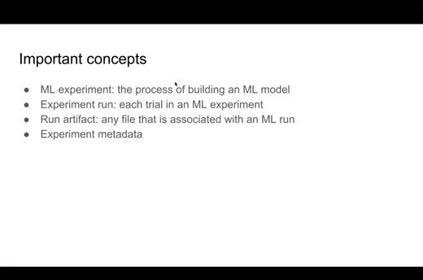
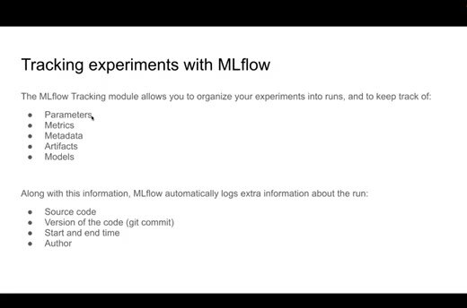
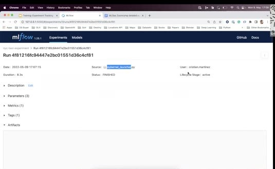

# Experiment Tracking Intro

Experiment tracking records the information that changes while we build a model. It helps us reproduce a result, compare trials, and return to an earlier decision instead of relying on a spreadsheet or memory.

## Experiments, runs, and artifacts

An experiment is the larger modeling activity, such as trying several algorithms and hyperparameters for taxi duration prediction. Each trial is a run. A run can record parameters, metrics, and metadata. It can also keep files and a trained model.

Parameters include values such as the model's `alpha`, the training data path, and the validation data path. Metrics include measurements such as RMSE on the training or validation set. Artifacts are files we want to keep with the run, such as plots, serialized models, or reports.

## Reasons to track runs

We track runs for three practical reasons:

- Reproducibility: we can see which code, data, and parameters produced a result.
- Organization: teammates can find the experiment and understand what changed.
- Optimization: we can compare many trials and choose a model with evidence.

## Start with MLflow

MLflow is an open-source Python package for the machine learning lifecycle. Its tracking module organizes experiments into runs, and its model registry helps us manage models after we select a candidate.

You can start with a local MLflow setup. A remote tracking server becomes useful when several people need to share runs and artifacts, but it isn't required for the first experiment.
