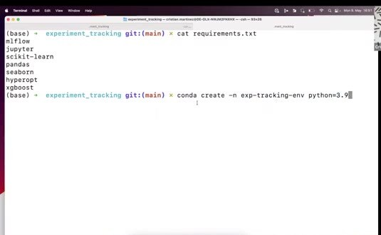
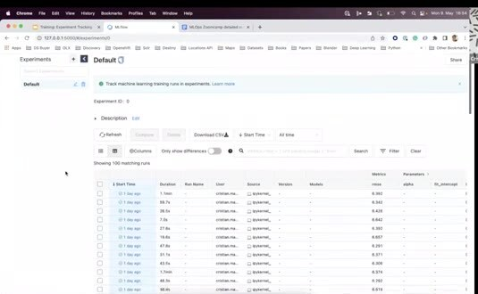
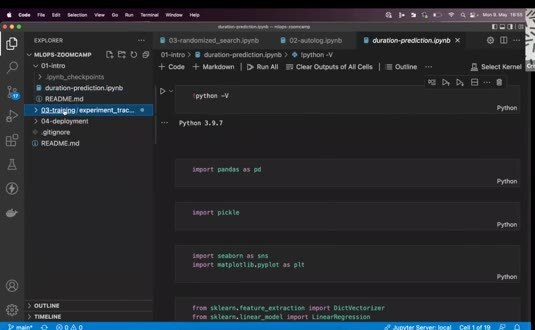

# Getting Started with MLflow

In this unit, we install MLflow, start its local UI, and add the first tracking calls to the duration prediction notebook. The video uses Jupyter inside VS Code, but the same Python code works in a browser notebook on the VM from Module 1.

## Create the environment

Create and activate a separate environment so the tracking packages don't change the rest of your Python installation. Then install the module requirements.

```bash
conda create -n experiment-tracking python=3.9
conda activate experiment-tracking
pip install -r requirements.txt
```



## Start the MLflow UI

For a useful local setup, store the tracking metadata in SQLite:

```bash
mlflow ui --backend-store-uri sqlite:///mlflow.db
```

Open the URL printed by MLflow. The UI lists experiments and runs, and the backend store also enables the model registry tab.



## Configure the notebook

Point the client at the same SQLite database and select an experiment:

```python
import mlflow

mlflow.set_tracking_uri('sqlite:///mlflow.db')
mlflow.set_experiment('nyc-taxi-experiment')
```

MLflow creates the experiment when it doesn't exist and adds later runs to it. Before saving a trained model, create the `models` directory so the notebook has a destination for its files.



We still change model parameters manually in the initial notebook, so the next unit wraps those changes in tracked runs.
