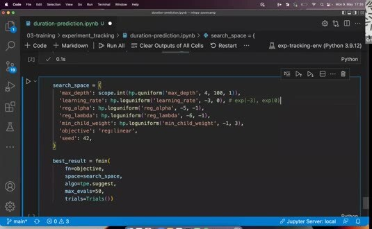
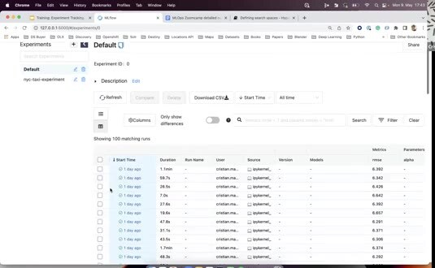
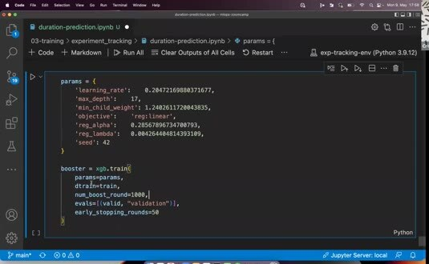

# Experiment Tracking with MLflow

We still change `alpha` and other model settings in the baseline notebook without keeping the history. MLflow gives each trial a run and stores the values needed to compare the trials later.

## Define the objective

For hyperparameter tuning, define a function that accepts a parameter set and trains the model. It predicts on the validation data and returns the validation RMSE. Hyperopt can minimize this value while MLflow logs the details of every trial.



The search space describes the values that Hyperopt can try. For example, `max_depth` can be an integer range and `learning_rate` can use a logarithmic range. The objective returns the loss and a success status so the optimizer can choose the next trial.

## Log each run

Start an MLflow run inside the objective function and log the values that affect the result:

```python
with mlflow.start_run():
    mlflow.log_params(params)
    mlflow.log_metric('rmse', rmse)
    mlflow.log_param('train_data', train_data_path)
    mlflow.log_param('valid_data', valid_data_path)
```



The UI can compare parameters and metrics across all runs. It also records run metadata such as start time, duration, user, and source information. If the model trains over many iterations, log a metric at each iteration to display a learning curve.

## Select and save the best model

After Hyperopt finds the best parameters, train one final model with those values. Log the final parameters, RMSE, and model artifact so the selected model has the same lineage as the search runs.


