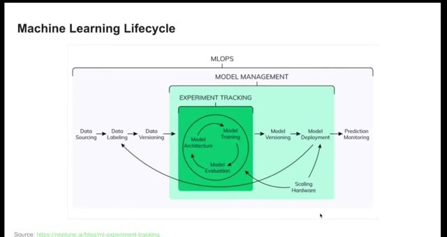
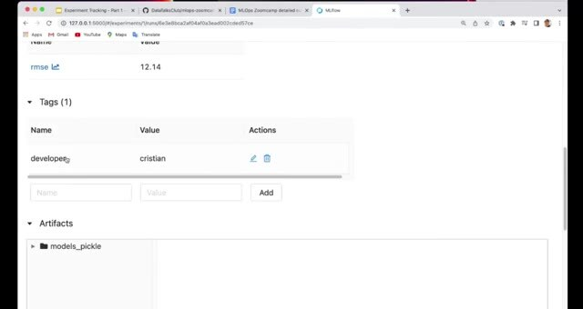
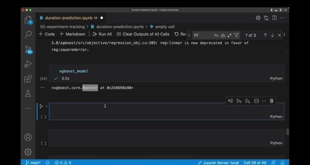

# Model Management

Experiment tracking covers the trials that create models. After we select a candidate, we keep its model and lineage together. We also keep the parameters and metrics so another person can evaluate and deploy it.

## From experiments to a model

The ML lifecycle moves from tuning to a decision about which model is ready for further use. At that point, we need to know which data and code produced it. We also need the parameters, evaluation results, and files that belong to it.

MLflow can log parameters, metrics, artifacts, and models. Its autologging integrations add common information for supported libraries, which reduces the amount of manual logging in a training script.

## Use autologging carefully

Autologging is useful when the library integration records the values you need. Check the resulting run instead of assuming that every important input was captured. Add explicit parameters for values such as data paths or preprocessing choices when they affect the result.

## Preserve lineage

The run should lead to the exact model artifact used later. Store the training and validation data references in one run. Add the model parameters, evaluation metric, and model file there as well. This gives deployment enough information to understand what it's serving.

