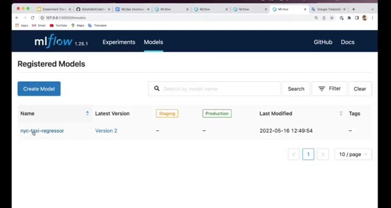
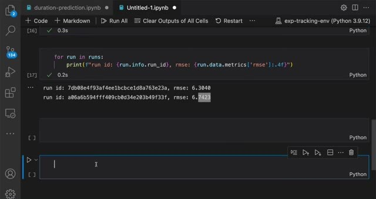
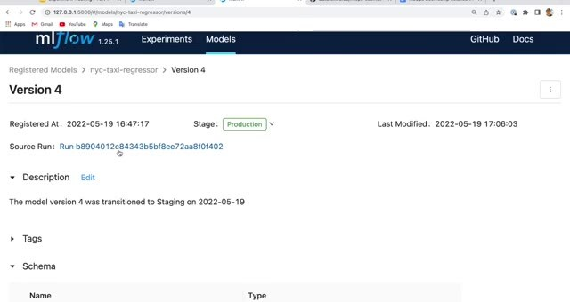

# Model Registry

A model registry gives the modeling and deployment teams a shared list of model versions. It doesn't deploy a model. It records which versions are candidates, what run produced each version, and which version the team has chosen for a stage of its process.

## Register a model version

After comparing runs, register the selected model in MLflow. Give the registered model a meaningful name, then attach the run that created it. The registry keeps a version number and links it back to the source run.

The deployment engineer can look at the parameters, performance, model size, and environment before promoting a version. Keeping this information in the registry improves communication between the person training the model and the person serving it.

## Manage versions and rollback

Use descriptions and tags to record what a version is for. A version can move through labels such as staging and production, and an older version can remain available for rollback. The registry supplies the metadata and labels. CI/CD or another deployment process performs the actual deployment.

## Reproduce the selected model

The run link lets you recover the parameters, metrics, artifacts, and environment used to train the version. This information matters when a model needs to be retrained or when a production result looks different from the original experiment.

MLflow 2.9 deprecated model registry stages. For new integrations, use model version tags and aliases, such as `set_registered_model_alias`, instead of building new code around stage transitions.
