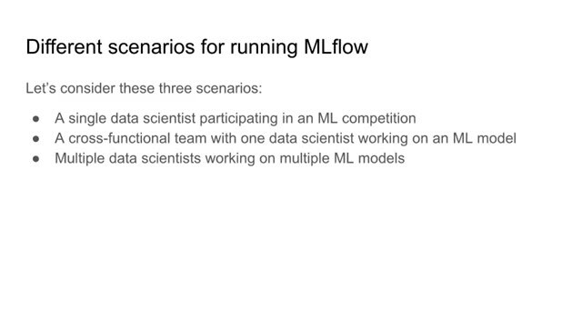
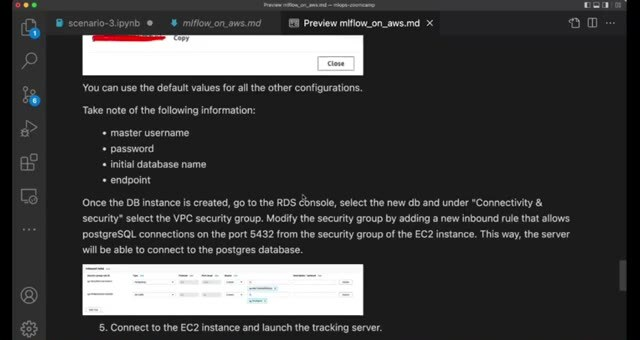
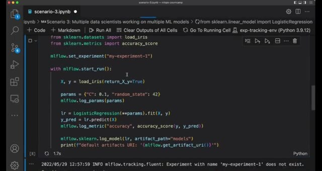

# MLflow in Practice

The right MLflow setup depends on the number of people, models, and runs involved. The examples use three scenarios to move from one person working locally to a shared tracking server with a remote artifact store.

## Scenario 1: one person, local tracking

When one data scientist builds one model, a local MLflow UI and local artifacts may be enough. This setup has little infrastructure and makes it easy to learn the tracking API.

## Scenario 2: several models, local tracking

When the same person builds several models, the local tracking server can still organize experiments and runs. A model registry becomes useful when the person needs to identify which model should be deployed.



## Scenario 3: shared remote tracking

When a team needs to collaborate, we run the tracking server on a shared EC2 instance. We store run metadata in a database and artifacts in an S3 bucket. The AWS setup in [MLflow on AWS](docs/mlflow_on_aws.md) covers EC2, RDS PostgreSQL, and S3. It also explains security groups and the server command.



The client points at the remote tracking URI, creates an experiment, and logs runs just as it did locally:

```python
mlflow.set_tracking_uri('http://<EC2_PUBLIC_DNS>:5000')
mlflow.set_experiment('nyc-taxi-experiment')
```



The remote setup lets teammates share experiments, but AWS services can incur charges. Shut down resources you no longer need and keep database credentials private.
