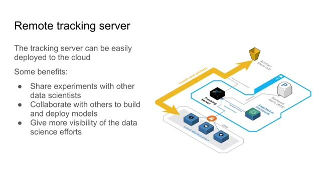
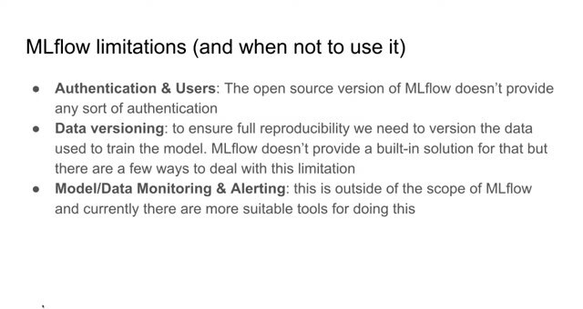
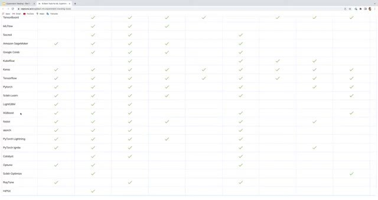

# MLflow: Benefits, Limitations and Alternatives

MLflow gives a team a common place to compare runs, store artifacts, and manage model versions. The right choice still depends on the project, the data, the deployment platform, and the amount of infrastructure the team wants to maintain.

## Benefits of a remote server

A shared server lets data scientists see one another's experiments, share data and artifacts, and collaborate on model selection. A registry gives deployment engineers a clear place to find models that are candidates for production.

## Limitations to account for

MLflow tracking doesn't automatically version every input dataset or guarantee that a run can be reproduced. You still need to version data, code, environment files, and any preprocessing that happens outside the logged run. A remote server also needs a database, artifact storage, access control, and ongoing maintenance.

## Compare alternatives

Consider another platform when you need a managed service, a different deployment integration, or stronger dataset and pipeline management. Compare these capabilities.

- experiment parameters and metrics.
- model artifacts and lineage.
- dataset versioning.
- model promotion and serving.
- collaboration, access, and cost.

Start by defining the information the team must preserve. Then choose the smallest tool that records it reliably and fits the way the team trains and serves models.
