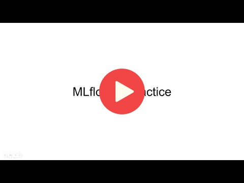
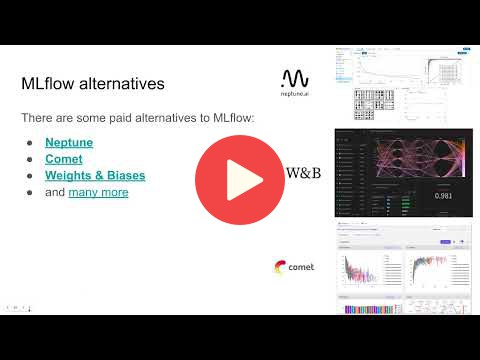

# 2. Experiment tracking and model management

* [Slides](https://drive.google.com/file/d/1YtkAtOQS3wvY7yts_nosVlXrLQBq5q37/view?usp=sharing)

## 2.1 Experiment tracking intro

## 2.2 Getting started with MLflow

Note: in the videos, Cristian uses Jupyter in VS code and runs everything locally

But if you set up a VM in the previous module, you can keep using it
and use the usual Jupyter from your browser. There's no significant
difference between using Jupyter with VS code and without

## 2.3 Experiment tracking with MLflow

## 2.4 Model management

## 2.5 Model registry

## 2.6 MLflow in practice

## 2.7 MLflow: benefits, limitations and alternatives

## 2.7 Homework

More information [here](../cohorts/2023/02-experiment-tracking/homework.md).

## Weights & Biases Workshop

More information [here](../cohorts/2023/02-experiment-tracking/wandb.md)

## Notes

Did you take notes? Add them here:

* [Notes/General Docs on MLflow by Ayoub](https://gist.github.com/Qfl3x/ccff6b0708358c040e437d52af0c2e43)
* [Minimalist MLflow code reference by Anna V](https://github.com/annnvv/mlops_zoomcamp/blob/main/notes/module2_notes_MLflow.md)
* [Notes from second lesson by Neimv](https://gitlab.com/neimv/mlops/-/blob/main/lessons_weeks/notes_2.md)
* [2nd Week Experiment & Tracking notes by Ayoub.B](https://github.com/ayoub-berdeddouch/mlops-journey/blob/main/experiment_tracking_02.md)
* [Experiment tracking (jupyterbook) by particle1331](https://particle1331.github.io/ok-transformer/nb/mlops/03-mlflow.html)
* [Week 2: Experiment & Tracking Notes by Bengsoon Chuah](https://github.com/bengsoon/mlops-zoomcamp/blob/main/02-experiment-tracking/notes/Experiment_Tracking_notes.md)
* [2.4 Model Management Notes by Alvaro Pena](https://github.com/alvarofps/mlops-zoomcamp/blob/main/02-experiment-tracking/my-notes/2.4%20Model%20management.md)
* [Notes by Alvaro Navas](https://github.com/ziritrion/mlopszoomcamp/blob/main/notes/2_experiment.md)
* [Notebook from froukje](https://github.com/froukje/ml-ops-zoomcamp/blob/master/02-experiment-tracking/week02.ipynb) and [notes](https://medium.com/@falbrechtg/getting-started-with-mlflow-tracking-46a0089d6a73)
* [Blog post on setting up MLFlow on GCP by Isaac Kargar](https://kargarisaac.github.io/blog/mlops/data%20engineering/2022/06/15/MLFlow-on-GCP.html).
* [Week2: Experiment tracking notes and notebook by Bhagabat](https://github.com/BPrasad123/MLOps_Zoomcamp/tree/main/Week2)
* [Notes of ML-flow by Jaime Cabrera-Salcedo](https://github.com/jaimeh94/MLOps-Zoomcamp/tree/main/02-experiment-tracking)
* Send a PR, add your notes above this line
