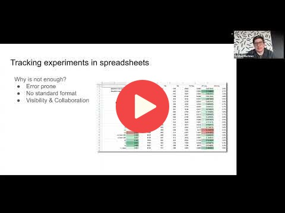
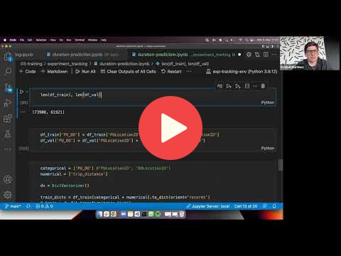
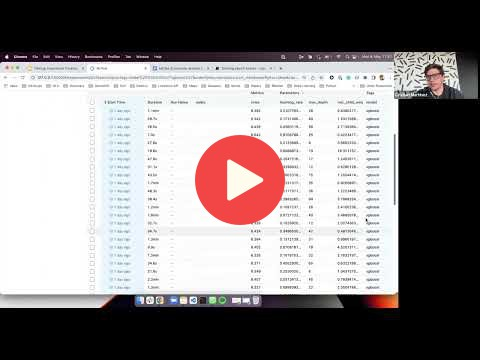
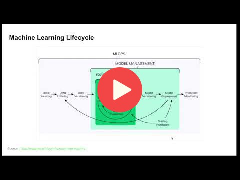
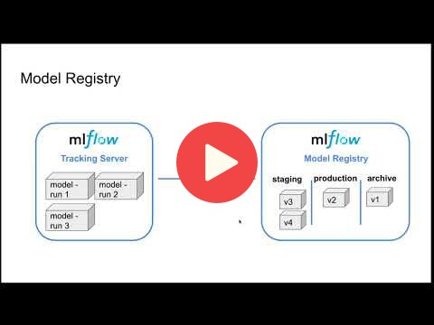

# 2. Experiment tracking and model management

## 2.1 Experiment tracking intro

## 2.2 Getting started with MLflow

Note: in the videos, Cristian uses Jupyter in VS code and runs everything locally

But if you set up a VM in the previous module, you can keep using it
and use the usual Jupyter from your browser. There's no significant
difference between using Jupyter with VS code and without

## 2.3 Experiment tracking with MLflow

## 2.4 Model management

## 2.5 Model registry

## 2.6 MLflow in practice

COMING SOON

## 2.7 Homework

More information here: [homework.md](homework.md)

## Notes

Did you take notes? Add them here:
* [Notes/General Docs on MLflow by Ayoub](https://gist.github.com/Qfl3x/ccff6b0708358c040e437d52af0c2e43)

* Send a PR, add your notes above this line
