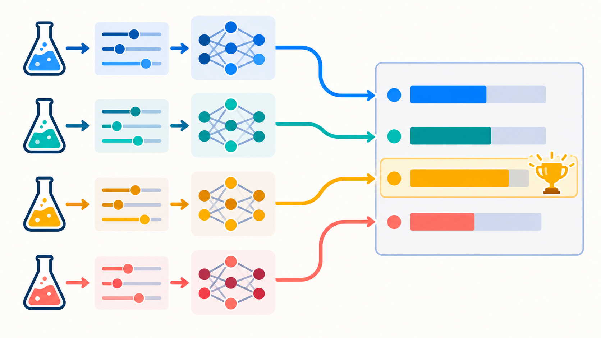
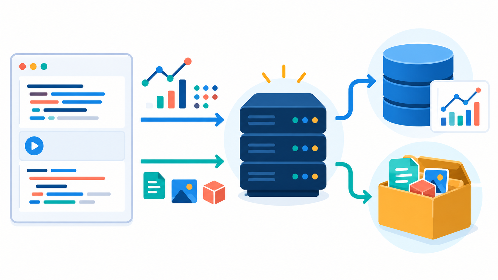
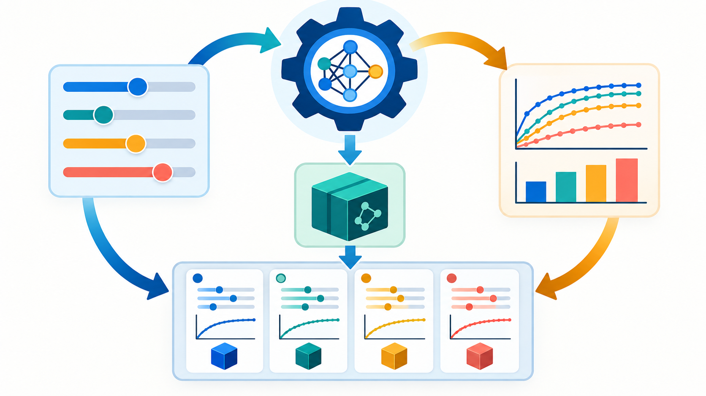
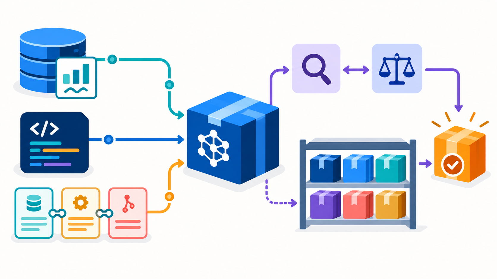
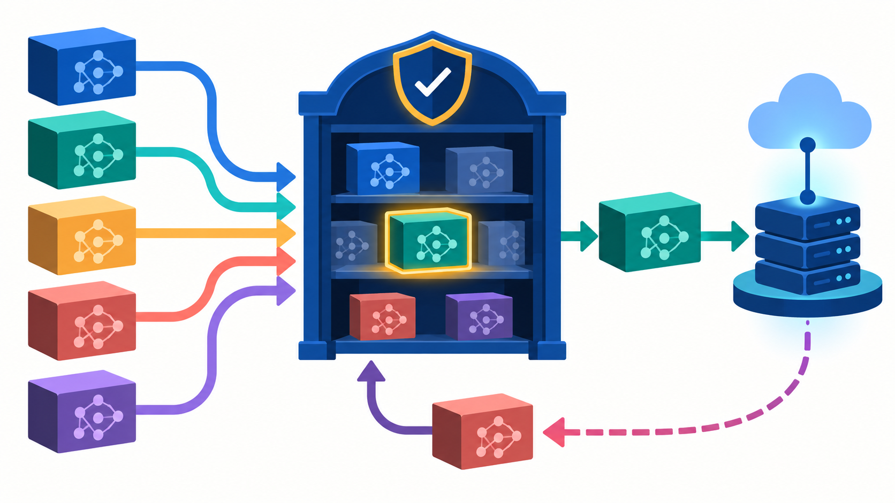
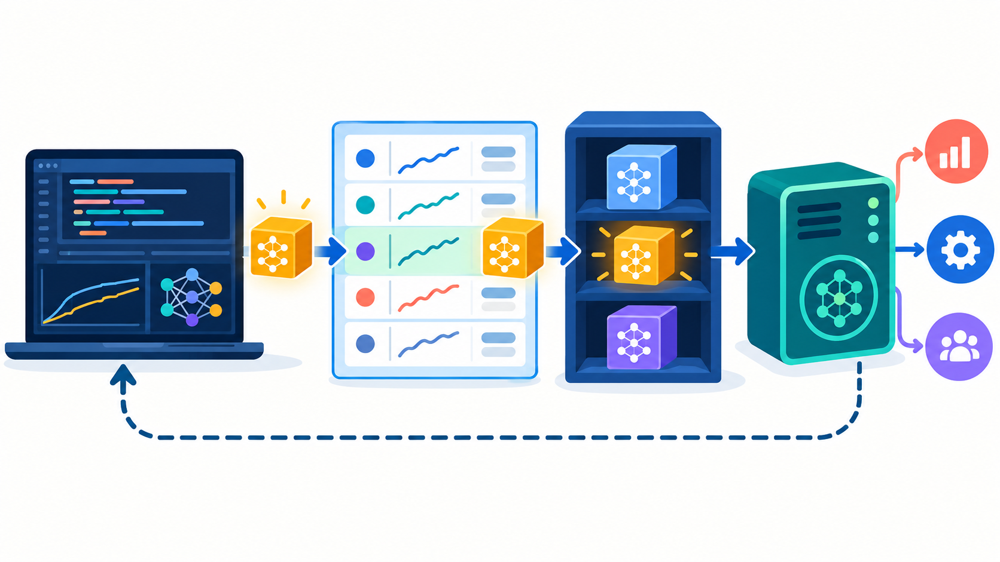
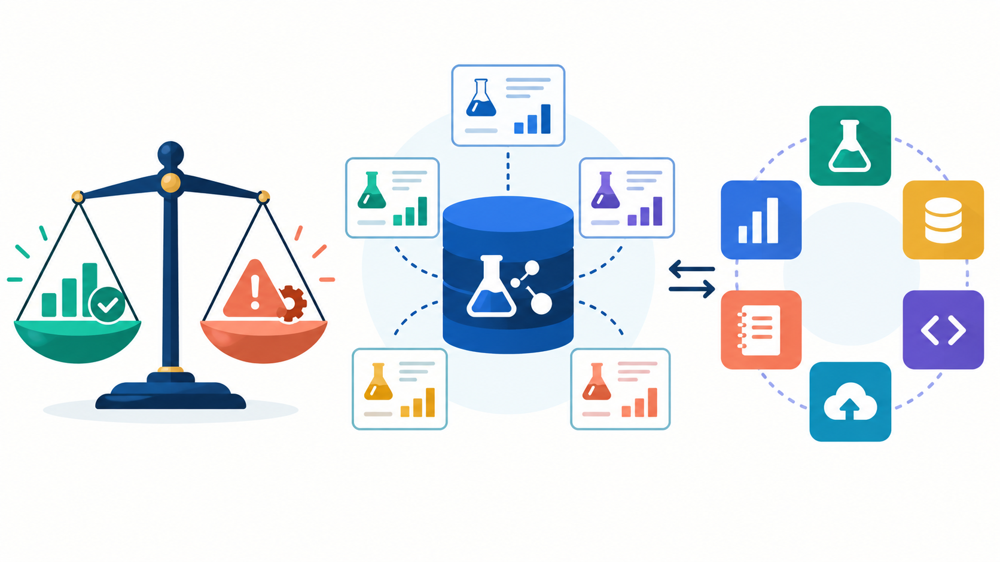

# 2. Experiment tracking and model management

* [Slides](https://drive.google.com/file/d/1YtkAtOQS3wvY7yts_nosVlXrLQBq5q37/view?usp=sharing)
  
* **NOTE:** `list_experiments` has been replaced by `search_experiments`. Some notebooks used in this course might need to be updated. | [Reference](https://github.com/mlflow/mlflow/issues/8941)

## 2.1 Experiment tracking intro

[Watch the experiment tracking introduction](https://www.youtube.com/watch?v=MiA7LQin9c8&list=PL3MmuxUbc_hIUISrluw_A7wDSmfOhErJK)

<figure>
  
  <figcaption>Experiment tracking makes parallel trials comparable by preserving their settings and outcomes.</figcaption>
</figure>

## 2.2 Getting started with MLflow

[Watch the MLflow getting started video](https://www.youtube.com/watch?v=cESCQE9J3ZE&list=PL3MmuxUbc_hIUISrluw_A7wDSmfOhErJK)

<figure>
  
  <figcaption>A first tracking setup connects the training code to a server for metrics and durable artifacts.</figcaption>
</figure>

Note: in the videos, Cristian uses Jupyter in VS code and runs everything locally

But if you set up a VM in the previous module, you can keep using it
and use the usual Jupyter from your browser. There's no significant
difference between using Jupyter with VS code and without

## 2.3 Experiment tracking with MLflow

[Watch the MLflow experiment tracking video](https://www.youtube.com/watch?v=iaJz-T7VWec&list=PL3MmuxUbc_hIUISrluw_A7wDSmfOhErJK)

<figure>
  
  <figcaption>Each run records the ingredients, measurements, and resulting model artifact needed for reproducible comparison.</figcaption>
</figure>

## 2.4 Model management

[Watch the model management video](https://www.youtube.com/watch?v=OVUPIX88q88&list=PL3MmuxUbc_hIUISrluw_A7wDSmfOhErJK)

<figure>
  
  <figcaption>Model management preserves lineage and organizes model artifacts across reviewable versions.</figcaption>
</figure>

## 2.5 Model registry

[Watch the model registry video](https://www.youtube.com/watch?v=TKHU7HAvGH8&list=PL3MmuxUbc_hIUISrluw_A7wDSmfOhErJK)

<figure>
  
  <figcaption>A registry controls promotion to serving and keeps an earlier version available for rollback.</figcaption>
</figure>

> **Starting MLflow 2.9, model registry stages are deprecated.**
Please use model version tags and aliases instead of stages. For example, instead of `transition_model_version_stage(name, version, stage)` use `set_registered_model_alias(name, alias, version)`. More details [here](https://github.com/mlflow/mlflow/issues/10336) and [here](https://mlflow.org/docs/latest/model-registry.html).

## 2.6 MLflow in practice

[Watch the MLflow in practice video](https://www.youtube.com/watch?v=1ykg4YmbFVA&list=PL3MmuxUbc_hIUISrluw_A7wDSmfOhErJK)

<figure>
  
  <figcaption>In practice, a tracked training run can flow through comparison and registration before serving.</figcaption>
</figure>

## 2.7 MLflow: benefits, limitations and alternatives

[Watch the MLflow alternatives video](https://www.youtube.com/watch?v=Lugy1JPsBRY&list=PL3MmuxUbc_hIUISrluw_A7wDSmfOhErJK)

<figure>
  
  <figcaption>Tool choice balances the benefits of a tracking hub against its limitations and available alternatives.</figcaption>
</figure>

## 2.7 Homework

More information [here](../cohorts/2025/02-experiment-tracking/homework.md).

<figure>
  
  <figcaption>Homework turns experiment-tracking concepts into a small, reviewable practice deliverable.</figcaption>
</figure>

## Notes

Did you take notes? Add them here:

* [Notes/General Docs on MLflow by Ayoub](https://gist.github.com/Qfl3x/ccff6b0708358c040e437d52af0c2e43)
* [Minimalist MLflow code reference by Anna V](https://github.com/annnvv/mlops_zoomcamp/blob/main/notes/module2_notes_MLflow.md)
* [Notes from second lesson by Neimv](https://gitlab.com/neimv/mlops/-/blob/main/lessons_weeks/notes_2.md)
* [2nd Week Experiment & Tracking notes by Ayoub.B](https://github.com/ayoub-berdeddouch/mlops-journey/blob/main/experiment_tracking_02.md)
* [Experiment tracking (jupyterbook) by particle1331](https://particle1331.github.io/ok-transformer/nb/mlops/03-mlflow.html)
* [Week 2: Experiment & Tracking Notes by Bengsoon Chuah](https://github.com/bengsoon/mlops-zoomcamp/blob/main/02-experiment-tracking/notes/Experiment_Tracking_notes.md)
* [2.4 Model Management Notes by Alvaro Pena](https://github.com/alvarofps/mlops-zoomcamp/blob/main/02-experiment-tracking/my-notes/2.4%20Model%20management.md)
* [Notes by Alvaro Navas](https://github.com/ziritrion/mlopszoomcamp/blob/main/notes/2_experiment.md)
* [Notebook from froukje](https://github.com/froukje/ml-ops-zoomcamp/blob/master/02-experiment-tracking/week02.ipynb) and [notes](https://medium.com/@falbrechtg/getting-started-with-mlflow-tracking-46a0089d6a73)
* [Blog post on setting up MLFlow on GCP by Isaac Kargar](https://kargarisaac.github.io/blog/mlops/data%20engineering/2022/06/15/MLFlow-on-GCP.html).
* [Week2: Experiment tracking notes and notebook by Bhagabat](https://github.com/BPrasad123/MLOps_Zoomcamp/tree/main/Week2)
* [Notes of ML-flow by Jaime Cabrera-Salcedo](https://github.com/jaimeh94/MLOps-Zoomcamp/tree/main/02-experiment-tracking)
* [Experiment tracking with MLflow by Hongfan (Amber)](https://github.com/Muhongfan/MLops/blob/main/02-experiment-tracking/README.md)
* [Running MLflow with Docker and on Minikube](https://open.substack.com/pub/asfandqazi/p/mlflow-on-minikube?r=2o17tf&utm_campaign=post&utm_medium=web)
* [Chapter 2: Full Notes by Marcus](https://github.com/mleiwe/mlops-zoomcamp/blob/Ch2_Marcus/cohorts/2024/02-experiment-tracking/Ch2_notes.md)
* [Experiemnt Tracking and Mlflow by Annaliese Tech](https://github.com/AnnalieseTech/MLOPS_ZOOMCAMP/blob/main/02_EXPERIMENT_TRACKING/EXPERIMENT_TRACKING_NOTES.md)
* [Adding Hyperparameter Tuning to Your Notebook with MLflow and Hyperopt by Annaliese Tech](https://github.com/AnnalieseTech/MLOPS_ZOOMCAMP/blob/main/02_EXPERIMENT_TRACKING/Hyperparameter-Tuning.md)
* [MLFlow setup and Experiment Tracking by Hokfu](https://github.com/Hokfu/MLOps_Zoomcamp_Study/blob/main/02-experiment-tracking/README.md)
* [2025 Cohort | Notes on MLflow & Hyperopt by Gabi Fonseca](https://github.com/fonsecagabriella/ml_ops/blob/main/02_experiment_tracking/__notes.md)
* [Homework 2 Experiment and Tracking article by Srikanth Ganji](https://medium.com/@srikanth.unix07/mlops-zoomcamp-2025-homework-2-experiment-tracking-with-mlflow-4ea1ed783531)
* [Week-2 - Detailed Notes of MLFlow, Experiment Tracking, Notebooks, Homework by Muhammad Shifa](https://github.com/MuhammadShifa/mlops-zoomcamp2025/blob/main/02-experiment-tracking/README.md)
* Send a PR, add your notes above this line
