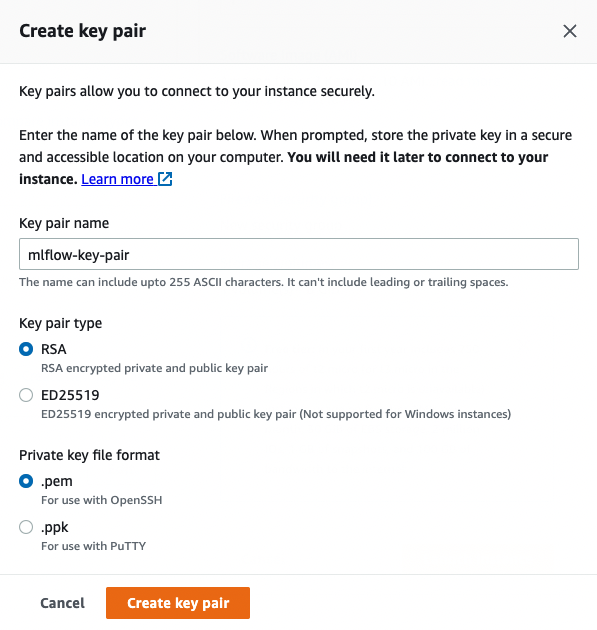

# Basic AWS setup

This tutorials explains how to configure a remote tracking server on AWS. We will use an RDS database as the backend store and an s3 bucket as the artifact store.

1. First, you need to [create an AWS account](https://aws.amazon.com/free). If you open a new account, AWS allows you to use some of their products for free but take into account that **you may be charged for using the AWS services**. More information [here](https://youtu.be/rkKvzCskpLE) and [here](https://aws.amazon.com/premiumsupport/knowledge-center/free-tier-charges/).

2. Launch a new EC2 instance.

For this, you can select one of the instance types that are free tier eligible. For example, we will select an Amazon Linux OS (`Amazon Linux 2 AMI (HVM) - Kernel 5.10, SSD Volume Type`) and a `t2.micro` instance type, which are free tier eligible. 

You'll also need to create a new key pair so later you can connect to the new instance using SSH. Click on "Create new key pair" and complete the details like in the image below:

Select the new key pair and then click on "Launch Instance".

Finally, you have to edit the security group so the EC2 instance accepts SSH (port 22) and HTTP connections (port 5000):

3. Create an s3 bucket to be used as the artifact store.

Go to s3 and click on "Create bucket". Fill in the bucket name as in the image below and let all the other configurations with their default values.

Note: s3 bucket names must be unique across all AWS account in all the AWS Regions within a partition, that means that once a bucket is created, the name of that bucket cannot be used by another AWS account within the same region. If you get an error saying that the bucket name was already taken you can fix it easily by just changing the name to something like `mlflow-artifacts-remote-2` or another name.

4. Create a new PostgreSQL database to be used as the backend store

Go to the RDS Console and click on "Create database". Make sure to select "PostgreSQL" engine type and the "Free tier" template.

Select a name for your DB instance, set the master username as "mlflow" and tick the option "Auto generate a password" so Amazon RDS generate a password automatically.

Finally, on the section "Additional configuration" specify a database name so RDS automatically creates an initial database for you.

After clicking on "launch database" you will be able to check the newly generated password, but take into account that the automatically generated password will be shown only once!

You can use the default values for all the other configurations.

Take note of the following information:

* master username
* password 
* initial database name
* endpoint

Once the DB instance is created, go to the RDS console, select the new db and under "Connectivity & security" select the VPC security group. Modify the security group by adding a new inbound rule that allows postgreSQL connections on the port 5432 from the security group of the EC2 instance. This way, the server will be able to connect to the postgres database.

5. Connect to the EC2 instance and launch the tracking server.

Go to the EC2 Console and find the instance launched on the step 2. Click on "Connect" and then follow the steps described in the tab "SSH". 

Run the following commands to install the dependencies, configure the environment and launch the server:
* `sudo yum update`
* `pip3 install mlflow boto3 psycopg2-binary`
* `aws configure`   # you'll need to input your AWS credentials here
* `mlflow server -h 0.0.0.0 -p 5000 --backend-store-uri postgresql://DB_USER:DB_PASSWORD@DB_ENDPOINT:5432/DB_NAME --default-artifact-root s3://S3_BUCKET_NAME`

Note: before launching the server, check that the instance can access the s3 bucket created in the step number 3. To do that, just run this command from the EC2 instance: `aws s3 ls`. You should see the bucket listed in the result.

6. Access the remote tracking server from your local machine.

Open a new tab on your web browser and go to this address: `http://<EC2_PUBLIC_DNS>:5000` (you can find the instance's public DNS by checking the details of your instance in the EC2 Console).