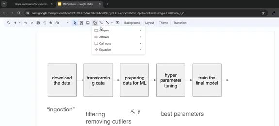
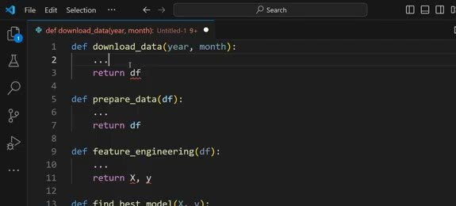

# Introduction to ML Pipelines

In the first module we explored a notebook. Here we turn that exploration into a repeatable training process. The process has explicit inputs, outputs, and dependencies.

## Training pipeline responsibilities

A training pipeline can be represented as a directed sequence:

1. Download the data.
2. Transform it and remove invalid or extreme records.
3. Prepare features and labels for machine learning.
4. Search for useful hyperparameters.
5. Train the final model with the selected parameters.

The exact steps depend on the problem, but the important change is that the workflow is explicit. Each step can be rerun, inspected, and replaced without redoing unrelated notebook cells.

## Pipeline versus orchestration

An ML pipeline describes the work and its dependencies.

Orchestration is the operational layer that runs the pipeline and handles four operational concerns:

- scheduling runs and passing parameters.
- recording status and retrying failures.
- supporting historical backfills.

Start with Python functions, then connect them to an orchestrator such as Airflow or Prefect. Dagster, Kestra, and Mage are also options.

We want a runnable, reproducible, parameterized process. For example, a training run should receive a data period rather than use whichever files happen to be present in a notebook session.

## A useful boundary

Keep data preparation, feature engineering, model selection, and final training as separate functions. Each stage needs a clear API, which lets you test the stages independently. In the next unit, we apply this boundary while converting the existing notebook into a command-line script.
