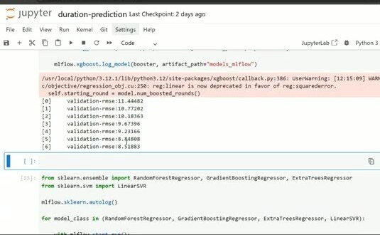
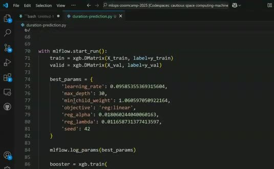
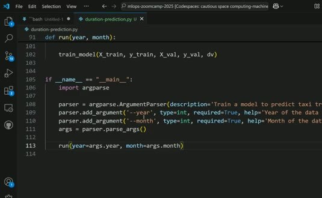
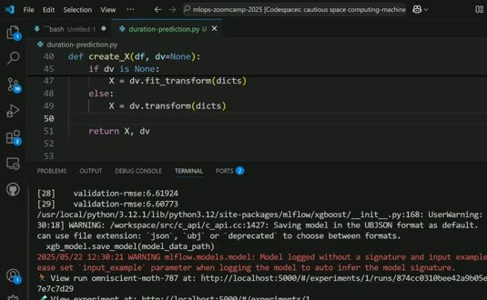

# Turning the Notebook into a Python Script

The Module 2 notebook is useful for exploration, but a production workflow needs a stable entry point. We refactor it into a Python script that can be called from a terminal, a scheduler, or an orchestrator.

## Keep the useful code, remove the session state

Start by grouping the notebook cells by responsibility. Create separate functions for loading data, preparing features, training the model, and running the experiment. A function boundary makes the inputs and outputs visible. It also avoids depending on variables left behind by an earlier cell.



The script can still use MLflow to track parameters, metrics, and the trained model. Put the tracking calls inside the run function so every execution produces a distinct run.

## Add a command-line interface

The training period should be an input, not a hard-coded constant. Use `argparse` to accept the year and month.

```python
parser.add_argument('--year', type=int, required=True)
parser.add_argument('--month', type=int, required=True)
args = parser.parse_args()
run(year=args.year, month=args.month)
```



Now the same code can train on a different month without editing the source:

```bash
python duration-prediction.py --year 2023 --month 3
```



## Preserve metadata and artifacts

Record the data period, feature choices, model parameters, and evaluation metrics in MLflow. Save the model artifact with the run so a later deployment step can identify exactly which code execution produced it.



This script is now a pipeline entry point. An orchestrator can call it with different periods, schedule it, retry it, or backfill historical periods without opening a notebook.
