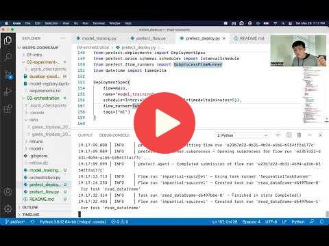

# 3. Orchestration and ML Pipelines

This section of the repo contains Python code to accompany the videos that show how to use Prefect for MLOps. We will create workflows that you can orchestrate and observe.

## 3.1 Introdution to Workflow Orchestration

<a href="https://www.youtube.com/watch?v=Cqb7wyaNF08&list=PL3MmuxUbc_hIUISrluw_A7wDSmfOhErJK">
  

## 3.2 Introduction to Prefect

<a href="https://www.youtube.com/watch?v=rTUBTvXvXvM&list=PL3MmuxUbc_hIUISrluw_A7wDSmfOhErJK">
  
</a>

## 3.3 Prefect Workflow

<a href="https://www.youtube.com/watch?v=x3bV8yMKjtc&list=PL3MmuxUbc_hIUISrluw_A7wDSmfOhErJK">
  

## 3.4 Deploying Your Workflow

<a href="https://www.youtube.com/watch?v=3YjagezFhOo&list=PL3MmuxUbc_hIUISrluw_A7wDSmfOhErJK">
  
</a>

## 3.5 Working with Deployments

<a href="https://www.youtube.com/watch?v=jVmaaqs63O8&list=PL3MmuxUbc_hIUISrluw_A7wDSmfOhErJK">
  
</a>

## 3.6 Prefect Cloud (optional)

<a href="https://www.youtube.com/watch?v=y89Ww85EUdo&list=PL3MmuxUbc_hIUISrluw_A7wDSmfOhErJK">
  
</a>

## 3.7 Homework

More information [here](../cohorts/2023/03-orchestration/homework.md).

## Quick setup

### Install packages

In a conda environment with Python 3.10.12 or similar, install all package dependencies with

```bash
pip install -r requirements.txt
```

### Start the Prefect server locally

Create another window and activate your conda environment. Start the Prefect API server locally with

```bash
prefect server start
```

### Alternative to self-hosted server use Prefect Cloud for added capabilties

Signup and use for free at <https://app.prefect.cloud>

Authenticate through the terminal with

```bash
prefect cloud login
```

Use your [Prefect profile](https://docs.prefect.io/latest/concepts/settings/) to switch between a self-hosted server and Cloud.

## Notes

Did you take notes? Add them here:

* [Prefect local deployment using Google Cloud Storage as data storage](https://github.com/ugm2/mlops-zoomcamp-workshop/tree/main/03-workflow-orchestration/3.5)
* Notes/Blog posts by Sagar Thacker
  * [Inrtoduction to Workflow Orchestratio & Prefect](https://sagarthacker.com/posts/mlops/intro_workflow_orchestration.html)
  * [Prefect Blocks](https://sagarthacker.com/posts/mlops/prefect-blocks.html)
  * [Prefect Deployments](https://sagarthacker.com/posts/mlops/prefect-deployment.html)
  * [Prefect Cloud Deployment](https://sagarthacker.com/posts/mlops/prefect-cloud.html)
* Send a PR, add your notes above this line

### Notes 2022 Edition

To read the notes from the previous edition, see [here](../cohorts/2022/03-orchestration/README.md)
