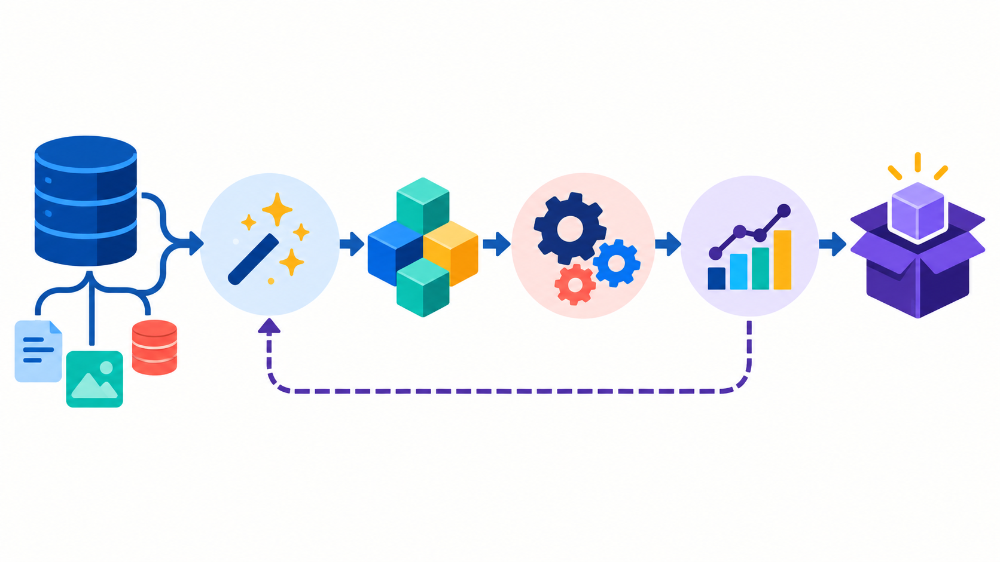
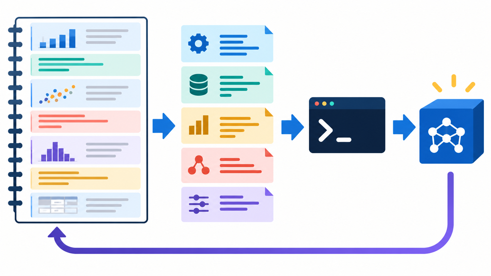
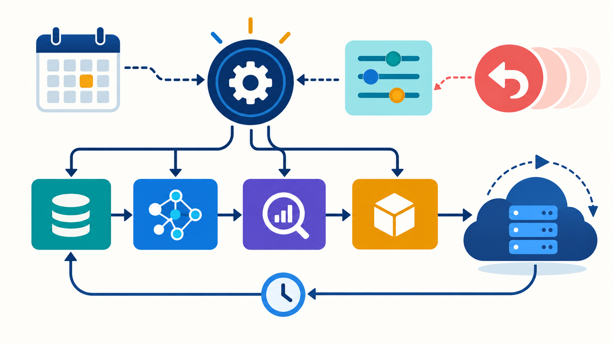

# 3. Orchestration and ML Pipelines

## 3.1 Introduction to ML Pipelines

<a href="https://www.youtube.com/watch?v=uAR4BhVCNbI&list=PL3MmuxUbc_hIUISrluw_A7wDSmfOhErJK">
  
</a>

<figure>
  
  <figcaption>An ML pipeline makes the dependencies between preparation, training, evaluation, and packaging explicit.</figcaption>
</figure>

## 3.2 Turning the Notebook into a Python Script

<a href="https://www.youtube.com/watch?v=3_Uu0rInxWI&list=PL3MmuxUbc_hIUISrluw_A7wDSmfOhErJK">
  
</a>

<figure>
  
  <figcaption>Moving from a notebook to a script turns exploration into a repeatable training entry point.</figcaption>
</figure>

## 3.3 Using an Orchestrator

Now that we converted the notebook into a python script, we 
can use an orchestrator to turn the script into a production
pipeline.

There's no video for this unit, but you can use ChatGPT to help you with this.

<figure>
  
  <figcaption>An orchestrator schedules dependent tasks, accepts parameters, supports backfills, and can run the workflow in production.</figcaption>
</figure>

### Step 1: Choosing the Tool

For that you first need to choose an orchestrator. For example:

- Airflow
- Prefect
- Dagster
- Kestra
- Mage
- or some other tool

### Step 2: Running the Tool

* Configure the tool to run locally 
* Run the simplest "hello world" workflow 

### Step 3: Orchestrating the Workflow

* Get the code from the previous unit (see [code](code/))
* Use the tool to orchestrate the steps in the pipeline

### Step 4: Parametrizing the Workflow

* Schedule the workflow to run monthly
* The train data should be from two months ago
* The validation data - one month ago

### Step 5: Backfilling

* Learn to run the workflow for some of the past months

### Step 6: Deployment (optional)

* Learn to deploy the tool to the cloud 

### Resources 

For guidance, you can refer to past cohorts of the course:

- Prefect - 2022 and 2023
- Mage - 2024

You can also rely on ChatGPT or similar tools. They are very helpful.

## 3.4 Homework

More information [here](../cohorts/2025/03-orchestration/homework.md).

<figure>
  
  <figcaption>Homework turns pipeline concepts into a small, reviewable practice deliverable.</figcaption>
</figure>


## Resources

### Mlflow

If you want to run MLFlow with Docker, you can do this:

Create a dockerfile for mlflow, e.g. `mlflow.dockerfile`:

```dockerfile
FROM python:3.10-slim

RUN pip install mlflow==2.12.1

EXPOSE 5000

CMD [ \
    "mlflow", "server", \
    "--backend-store-uri", "sqlite:///home/mlflow_data/mlflow.db", \
    "--host", "0.0.0.0", \
    "--port", "5000" \
]
```

Add it to the docker-compose.yaml:

```yaml
  mlflow:
    build:
      context: .
      dockerfile: mlflow.dockerfile
    ports:
      - "5000:5000"
    volumes:
      - "${PWD}/mlflow_data:/home/mlflow_data/"
```

In your code, make sure you use the same version of mlflow (`mlflow==2.12.1`).

When you run it, mlflow should be accessible at `http://mlflow:5000`.

## Notes

### Notes previous editions

- [2022 Prefect notes](../cohorts/2022/03-orchestration/README.md)
- [2023 Prefect notes](../cohorts/2023/03-orchestration/prefect/README.md)
- [2024 Mage notes](../cohorts/2024/03-orchestration/README.md)

### Notes 2025

Did you take notes? Add them here:

* [2025 Cohort | Running Airflow + MLflow using Docker by André Calatré](https://github.com/calatre/mlops-zoomcamp/tree/main/03-orchestration)
* [Week 3 - workflow orchestration & Prefect by hannarud](https://github.com/hannarud/mlops-zoomcamp-2025/blob/main/week3_notes.md)
* [Orchestration with Prefect Notes and Code by Muhammad Shifa](https://github.com/MuhammadShifa/mlops-zoomcamp2025/blob/main/03-orchestration/README.md)
* Send a PR, add your notes above this line
