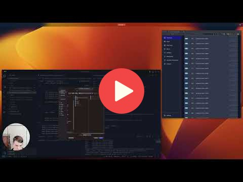
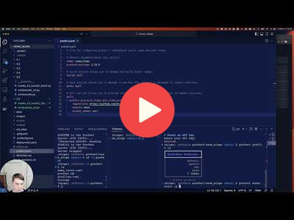

# 3. Orchestration and ML Pipelines

## 3.1 Introdution to Workflow Orchestration

## 3.2 Introduction to Prefect

## 3.3 Prefect Workflow

## 3.4 Deploying Your Workflow

## 3.5 Working with Deployments

## 3.6 Prefect Cloud (optional)

## 3.7 Homework

More information here: TBD

## Notes

Did you take notes? Add them here:

* Send a PR, add your notes above this line

### Notes 2022 Edition

To read the notes from the previous edition, see [here](../cohorts/2022/03-orchestration/README.md) 
