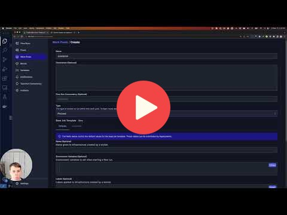

# 3. Orchestration and ML Pipelines

**Note:** [`orchestration.py`](orchestration.py) is a ready final version. The rest of the files were worked on together during the video tutorials.

## 3.1 Negative engineering and workflow orchestration

## 3.2 Introduction to Prefect 2.0

## 3.3 First Prefect flow and basics

## 3.4 Remote Prefect Orion deployment

## 3.5 Deployment of Prefect flow

Links:

* [Instructions for Hosting Prefect Orion](https://discourse.prefect.io/t/hosting-an-orion-instance-on-a-cloud-vm/967)

## 3.6 Homework

More information here: [homework.md](homework.md)

## Notes

Did you take notes? Add them here:

* [Week 3, Prefect Introduction and S3 Bucket configuration with Prefect by M. Ayoub C.](https://gist.github.com/Qfl3x/8dd69b8173f027b9468016c118f3b6a5)
* [Notes from froukje](https://github.com/froukje/ml-ops-zoomcamp/blob/master/week03_Orchestration_and_ML_Pipelines/week03_orchestration.ipynb)
* Send a PR, add your notes above this line
