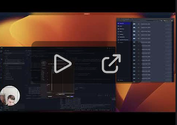
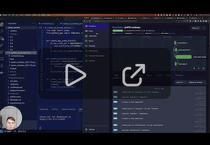

# 3. Orchestration and ML Pipelines


This section of the repo contains Python code to accompany the videos that show how to use Prefect for MLOps. We will create workflows that you can orchestrate and observe.

## 3.1 Introduction to workflow orchestration

<a href="https://www.youtube.com/watch?v=Cqb7wyaNF08">
  
</a>
https://www.youtube.com/playlist?list=PL3MmuxUbc_hKqamJqQ7Ew8HxptJYnXqQM

## 3.2 Introduction to Prefect

Coming soon!
<!-- <a href="">
  
</a> -->

## 3.3 Prefect workflow

<a href="https://www.youtube.com/watch?v=x3bV8yMKjtc">
  
</a>

## 3.4 Deploying your workflow

<a href="https://www.youtube.com/watch?v=3YjagezFhOo">
  
</a>

## 3.5 Working with Deployments

<a href="https://www.youtube.com/watch?v=jVmaaqs63O8">
  
</a>

## 3.6 Prefect Cloud (optional)

<a href="https://www.youtube.com/watch?v=y89Ww85EUdo">
  
</a>

## 3.7 Homework

Coming soon!

## Quick setup

### Install packages

In a conda environment with Python 3.10.12 or similar, install all package dependencies with

```bash
pip install -r requirements.txt
```

### Start the Prefect server locally

Create another window and activate your conda environment. Start the Prefect API server locally with 

```bash
prefect server start
```

### Alternative to self-hosted server use Prefect Cloud for added capabilties

Signup and use for free at https://app.prefect.cloud

Authenticate through the terminal with

```bash
prefect cloud login
```

Use your [Prefect profile](https://docs.prefect.io/latest/concepts/settings/) to switch between a self-hosted server and Cloud.

```bash

## Notes

Did you take notes? Add them here:


* Send a PR with a link to your notes above this line.
