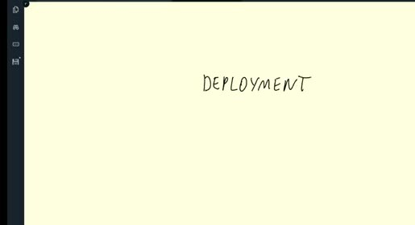
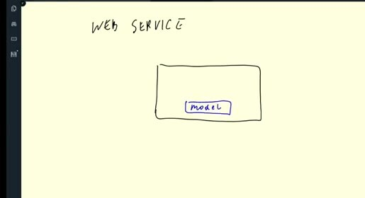
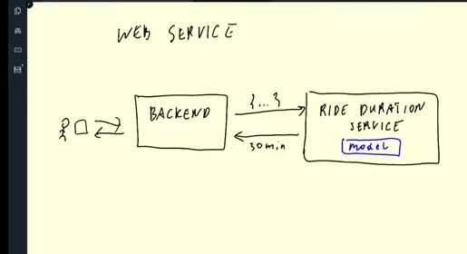

# Three Ways of Deploying a Model

After training and registering a model, we need to make it available for predictions. The right deployment mode depends on the prediction request, its latency requirement, and the amount of data waiting to be scored.

## Batch, online, and streaming

Batch deployment scores a complete data partition on a schedule. It's a good fit when results can arrive later, such as daily predictions for all rides.

Online deployment exposes a request/response service. A caller sends one feature record and receives a prediction quickly. A Flask service behind a container is a simple implementation of this approach.

Streaming deployment reacts to events as they arrive. A message broker or event stream accepts records, and a consumer scores them continuously. The course example uses Amazon Kinesis with AWS Lambda.

## Choose the boundary carefully

All three modes need the same serving API:

- the model to load.
- the transformation for an input record.
- the prediction format to return.

They differ in how they receive data and how long they can wait before producing a result.

Start with the simplest mode that meets the product requirement. Batch is usually easiest to operate. Online services add request handling and availability concerns. Streaming adds event ordering, retries, duplicates, and cloud-resource costs.

