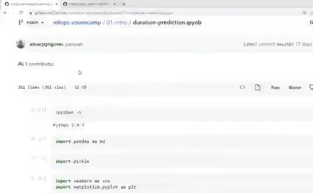
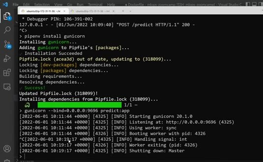
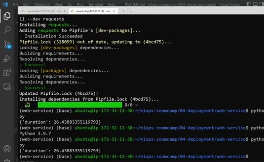

# Web Services: Deploying Models with Flask and Docker

We use a small Flask web service for the first deployment. It loads the model artifacts created during training, accepts a ride record, and returns a predicted duration.

## Load the artifacts

The example stores the dictionary vectorizer and the linear regression model as pickle files. Load them when the service starts rather than for every request. This keeps request handling focused on feature preparation and prediction.



The service should expose a narrow endpoint. A request contains the fields needed by the feature function, and the response contains a JSON prediction. Keep the input schema and output shape documented so clients can test the service without reading its implementation.

## Run the service

Flask can serve the application during development. Use a WSGI server such as Gunicorn for a production-style process.

Bind the server to an address reachable from the container:

```bash
gunicorn --bind=0.0.0.0:9696 predict:app
```

Test the endpoint with a representative request and verify both the status code and the prediction value. The code in [`web-service`](web-service) includes the application and a small test client.



## Package it with Docker

The container needs the correct Python base image, the dependency lock file, the model artifacts, and the application code.

Use a relative path inside the image:

```dockerfile
FROM python:3.9-slim
WORKDIR /app
COPY ["Pipfile", "Pipfile.lock", "predict.py", "lin_reg.bin", "./"]
RUN pip install pipenv && pipenv install --system --deploy
CMD ["gunicorn", "--bind=0.0.0.0:9696", "predict:app"]
```

Build and run the image:

```bash
docker build -t ride-duration-model .
docker run --rm -p 9696:9696 ride-duration-model
```


