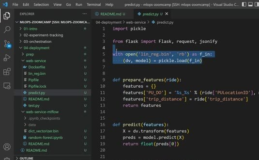
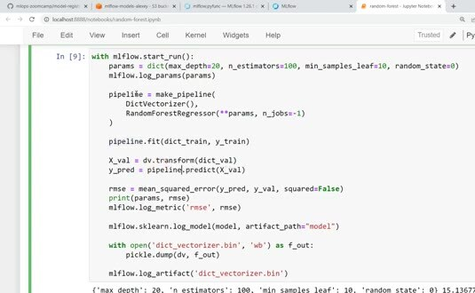
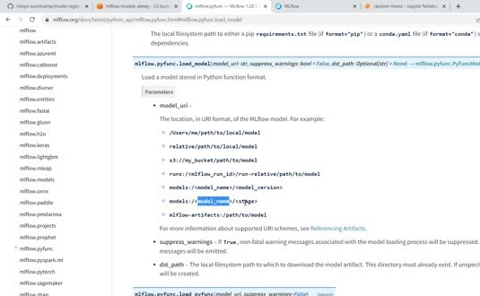

# Web Services: Getting Models from the Model Registry

Bundling a pickle file into a service works for a first deployment, but it couples the image to one model artifact. The model registry separates the service code from the model version it should serve.

## Register and select a model

During training, log the pipeline and its artifacts to MLflow. Register the resulting model under a stable name. A deployment can then select a version or an alias instead of copying a file into the service repository.



The service still needs the same feature preparation logic, but only the model-loading boundary changes. The example uses an MLflow client and a model URI, such as `models:/duration-prediction/Production` in older MLflow workflows or a versioned URI in a current registry.



## Load through the MLflow URI

The URI identifies the registered model and the selected version or stage.

The tracking server resolves the model metadata and artifact location, and the service loads the model with its MLflow flavor:

```python
import mlflow

model = mlflow.pyfunc.load_model(model_uri)
prediction = model.predict(features)
```



Keep the tracking URI, registry name, and selected model version in configuration. The service should fail clearly if it can't reach the tracking server or download the artifact. Pin the deployed version when reproducibility matters, and move the alias only after the new version has passed its checks.
