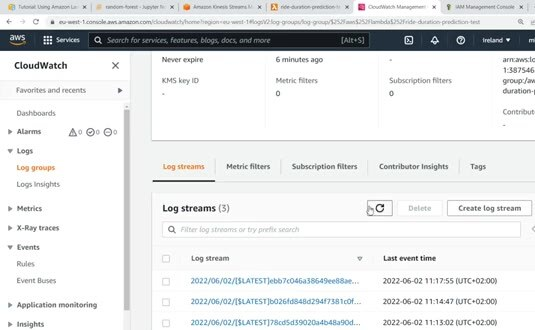
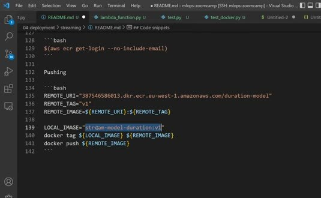
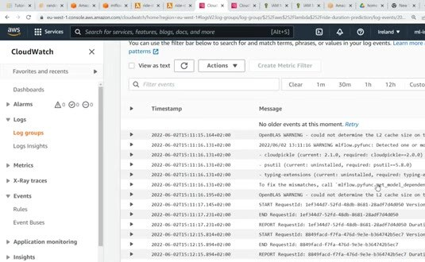

# Streaming: Deploying Models with Kinesis and Lambda

Streaming deployment scores records as they arrive. In this optional example, Amazon Kinesis acts as the event stream, while AWS Lambda consumes records and runs the model.

## Event flow

A producer writes ride events to an input stream. Kinesis groups the records into batches for the Lambda trigger. The function decodes each record, prepares the model features, loads the serving artifact, and publishes or logs the prediction.

The handler must treat the event format as part of its API. Kinesis records arrive encoded, so the function decodes the payload before parsing JSON. It should handle a batch without losing the relationship between an input ride and its output prediction.

## Package and operate the consumer

The course packages the Lambda dependency set as a container image. The image contains the handler and the libraries needed to load the model. Keep the model location configurable so the function can retrieve the artifact from the selected registry or object store.

Watch the logs while sending a test event. Logs should show the request identifier and enough context to diagnose a failed record without leaking sensitive input data.

Kinesis, Lambda, and ECR can incur AWS charges, so this deployment is optional. Delete test resources when you finish. Use the `streaming/` code in the Module 6 testing exercises.
