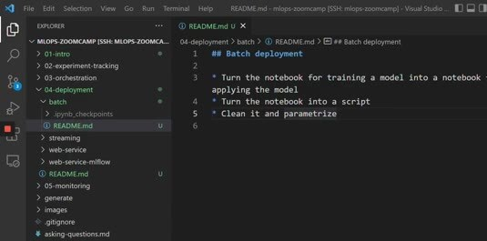
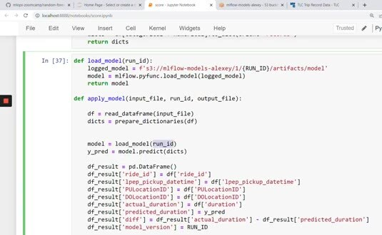
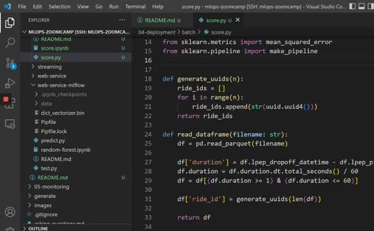

# Batch: Preparing a Scoring Script

Batch deployment runs the model against a complete input file or partition and writes predictions for later consumption. It's useful when a low-latency response is unnecessary and a scheduled job can process the available data together.

## Separate the scoring steps

Turn the scoring notebook into a script with clear stages:

- read the input data.
- prepare the same features used during training.
- load a specific model run or registered version.
- calculate predictions.
- write the output with the run identifier and model version.



The feature transformation used for scoring must match training. Reuse the serialized dictionary vectorizer or the complete model pipeline instead of rebuilding it with slightly different settings.

## Load the model and write results

The sample code loads a model artifact from the configured object store path. The scoring function adds identifiers and timestamps. When actual durations are available, it also records the actual duration, predicted duration, and model version in the result frame.



Expose the input and output paths as parameters, then pass the year and month with the run ID as additional parameters.

Use the same script for a scheduled month or a historical backfill:

```bash
python score.py \
  --year 2023 \
  --month 3 \
  --run-id <mlflow-run-id>
```


