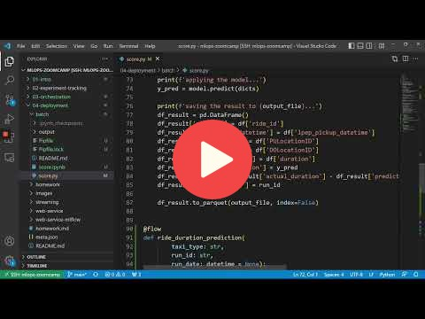

# 4. Model Deployment

## 4.1 Three ways of deploying a model

## 4.2 Web-services: Deploying models with Flask and Docker

[See code here](web-service/)

## 4.3 Web-services: Getting the models from the model registry (MLflow)

[See code here](web-service-mlflow/)

## 4.4 (Optional) Streaming: Deploying models with Kinesis and Lambda 

[See code here](streaming/)

## 4.5 Batch: Preparing a scoring script

[See code here](batch/)

## 4.6 MLOps Zoomcamp 4.6 - Batch: Scheduling batch scoring jobs with Prefect

## 4.7 Choosing the right way of deployment

COMING SOON

## 4.8 Homework

More information here: [homework.md](homework.md)

## Notes

Did you take notes? Add them here:

* [Notes on model deployment (+ creating a modeling package) by Ron M.](https://particle1331.github.io/inefficient-networks/notebooks/mlops/04-deployment/notes.html)
* [Notes on Model Deployment using Google Cloud Platform, by M. Ayoub C.](https://gist.github.com/Qfl3x/de2a9b98a370749a4b17a4c94ef46185)
* [Week4: Notes on Model Deployment by Bhagabat](https://github.com/BPrasad123/MLOps_Zoomcamp/tree/main/Week4)
* Send a PR, add your notes above this line
