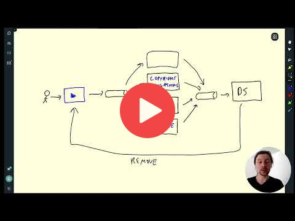
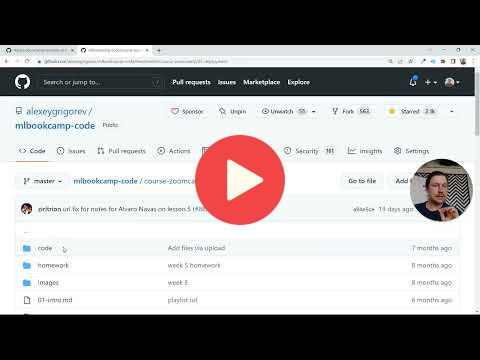
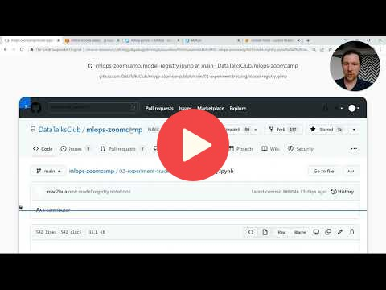
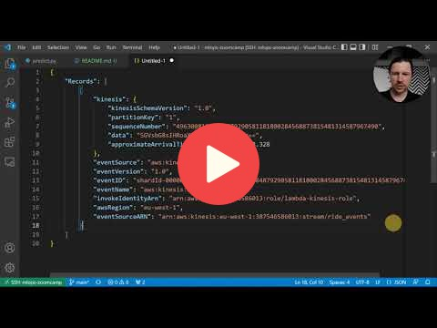
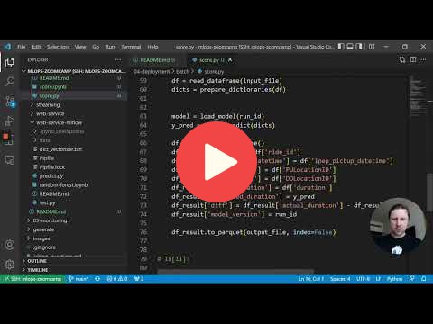

# 4. Model Deployment

## 4.1 Three ways of deploying a model

## 4.2 Web-services: Deploying models with Flask and Docker

[See code here](web-service/)

## 4.3 Web-services: Getting the models from the model registry (MLflow)

[See code here](web-service-mlflow/)

## 4.4 (Optional) Streaming: Deploying models with Kinesis and Lambda 

[See code here](streaming/)

## 4.5 Batch: Preparing a scoring script

[See code here](batch/)

## 4.6 MLOps Zoomcamp 4.6 - Batch: Scheduling batch scoring jobs with Prefect

The unit 4.6 consists of multiple videos:

* [4.6.1 - Package Manager](https://www.youtube.com/watch?v=DmWgkNA6i-w)
* [4.6.2 - Original FIle walkthrough](https://www.youtube.com/watch?v=2FUfbMqMEgg)
* [4.6.3 - Modifying score.py](https://www.youtube.com/watch?v=NWeTQEGufiI)
* [4.6.4 - Showing AWS Console](https://www.youtube.com/watch?v=fTQ3uqrGdrE)
* [4.6.5 - Running the file](https://www.youtube.com/watch?v=s4a-tU-t2XU)
* [4.6.6 - Create the project](https://www.youtube.com/watch?v=gdYM_-WShIU)
* [4.6.7 - Creating deployment](https://www.youtube.com/watch?v=vp3VbmAIv_Y)
* [4.6.8 - Backfilling update](https://www.youtube.com/watch?v=E42C1uyRiFA)
* [4.6.9 - Running on a functioning work pool](https://www.youtube.com/watch?v=K-FDw3HBcE4)
* [4.6.10 - Adding schedule](https://www.youtube.com/watch?v=0WpR3ZUINpA )
* [4.6.11 - Overview Wrap up](https://www.youtube.com/watch?v=C5mM8Jkt2jI)

## 4.7 Choosing the right way of deployment

COMING SOON

## 4.8 Homework

More information [here](../cohorts/2023/04-deployment/homework.md).

## Notes

Did you take notes? Add them here:

* [Notes on model deployment (+ creating a modeling package) by Ron M.](https://particle1331.github.io/inefficient-networks/notebooks/mlops/04-deployment/notes.html)
* [Notes on Model Deployment using Google Cloud Platform, by M. Ayoub C.](https://gist.github.com/Qfl3x/de2a9b98a370749a4b17a4c94ef46185)
* [Week4: Notes on Model Deployment by Bhagabat](https://github.com/BPrasad123/MLOps_Zoomcamp/tree/main/Week4)
* [Week 4: Deployment notes by Ayoub.B](https://github.com/ayoub-berdeddouch/mlops-journey/blob/main/deployment-04.md)
* Send a PR, add your notes above this line
