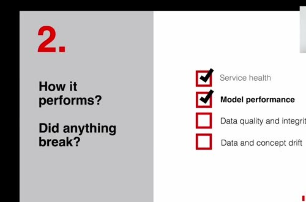
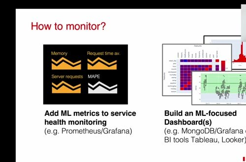
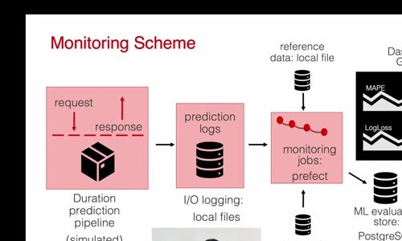

# Intro to ML Monitoring

Monitoring starts after a model is deployed. A production model can keep responding while its inputs, outputs, or business value quietly change, so operational metrics alone aren't enough.

## Four groups of monitoring metrics

The course introduces four useful groups of monitoring metrics:

- service health, such as uptime and request failures.
- model performance, such as an error metric when labels arrive.
- data quality and integrity, such as missing or invalid values.
- data drift and concept drift, which describe input changes and changes in the input-target relationship.

The exact performance metric depends on the task. Regression uses measures such as mean absolute error or root mean squared error. Classification may use precision, recall, or ranking metrics. Monitoring should use the metric that reflects the product requirement rather than a generic score.

## Compare production with a reference

Many model checks compare a current batch with a reference dataset. We use a reference period in which the model and data behaved acceptably. A large change is evidence to investigate, not proof that the model is wrong.

Good monitoring turns a vague concern into an actionable result. Define thresholds, store the measurements, and decide who investigates when a check fails.
