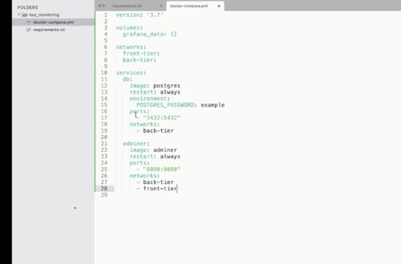
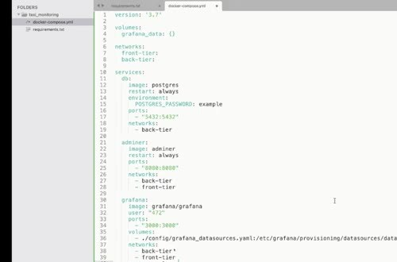
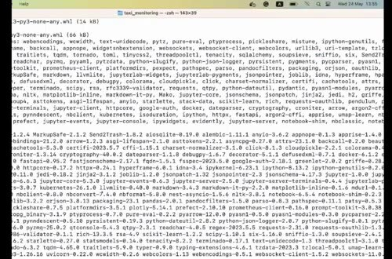

# Environment Setup

The monitoring example uses a small local stack. Python calculates metrics, PostgreSQL stores them, and Grafana displays them. Adminer is useful for inspecting the database while developing.

## Create the Python environment

Create a dedicated environment for the monitoring code and install the packages in `requirements.txt`. The current requirements set Evidently to 0.6.7. We keep the newer API example in `post-evidently-0.7`.

Store the reference data alongside the model under the local `data/` and `models/` directories. The repository ignores their generated contents, so each learner can create them locally.

## Start the services

The Compose file defines the database, Adminer, and Grafana. Use volumes for database state and mount Grafana configuration so the data source survives a container restart.

Run `docker-compose up` to start the stack, then open Grafana at `http://localhost:3000`. The example uses `admin` and `admin` as default credentials, while Adminer provides a separate browser interface for checking the PostgreSQL tables.

