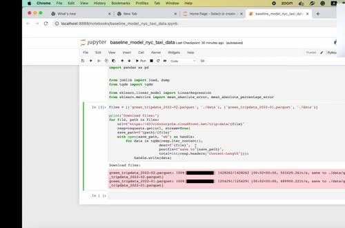
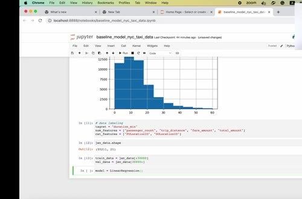
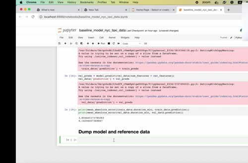

# Prepare Reference and Model

Before calculating drift or performance metrics, create a reference dataset and a model trained on historical data for a reasonable baseline.

## Build the baseline

The example uses New York taxi data to predict trip duration. Download the required parquet files and select the training period. Fit a simple linear regression model with the feature groups used elsewhere in the course.

Save the trained model under `models/` and save the reference data under `data/reference.parquet`. The reference data should contain the columns needed for monitoring, including the features and any target or prediction column that later metrics require.

## The role of the reference

We use the reference period as the comparison point for later batches. It provides the distributions that Evidently uses to calculate data drift, missingness, and prediction drift. It also gives you a model whose predictions can be reproduced when calculating a current batch.

Don't treat the reference as permanent truth. If the data-generating process changes and the team deliberately retrains the model, create a new reference version and record why it replaced the old one.
