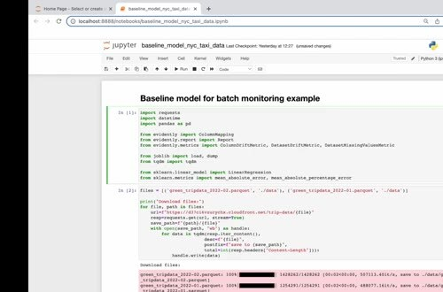
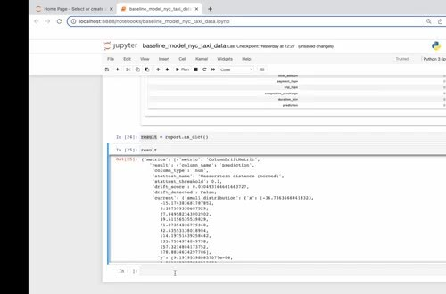
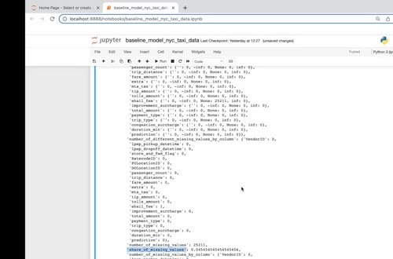

# Evidently Metrics Calculation

Evidently compares a reference dataset with a current dataset and produces a report. The report can calculate several aspects of model and data behavior in one run.

## Select metrics and map columns

The example calculates three useful metrics:

- drift for the prediction column.
- dataset drift across the monitored columns.
- the share of missing values in the current data.

Create a `ColumnMapping` so Evidently knows which columns are numerical, which are categorical, and which column contains the prediction. A correct mapping is as important as the metric choice because it controls how the distributions are interpreted.



```python
report.run(
    reference_data=reference_data,
    current_data=current_data,
    column_mapping=column_mapping,
)
```

The report evaluates the reference and current batch together. Save the HTML report when you need a human-readable investigation artifact, and extract the numeric values when you need to store time-series data for Grafana.



## Persist the result

The example inserts prediction drift, the number of drifted columns, and the share of missing values into PostgreSQL. A monitoring job can then repeat the calculation for each daily batch and append one timestamped row.


