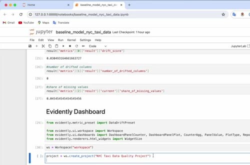
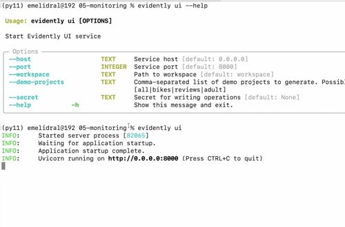
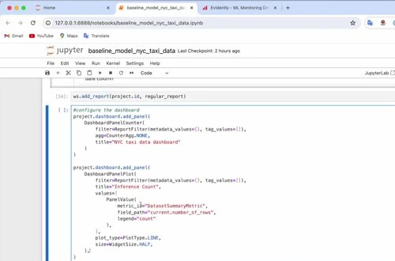

# Evidently Monitoring Dashboard

An Evidently report is useful for one comparison. A monitoring dashboard makes the same measurements visible over time and gives the team a place to look at recent batches.

## Create a project and workspace

The Evidently dashboard example creates a project, adds reports to a workspace, and previews the result before publishing it. Start with a small report so you can verify the column mapping and metric values before adding more panels.

Add reports for the reference and current batches. The workspace stores the report history, while the dashboard presents selected metrics such as prediction drift, missing values, and the number of drifted columns.

## Select useful panels

Use these panel types to answer an operational question:

- a trend panel that shows whether a metric is changing.
- a counter that shows the current number of drifted columns.
- a data-quality panel that highlights missing or invalid values.

The dashboard complements Grafana rather than replacing it. Evidently keeps the comparison details, while Grafana is a convenient place to combine monitoring metrics with database-backed alerting.
