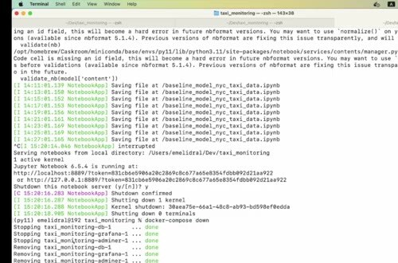
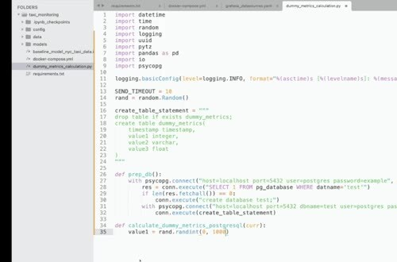
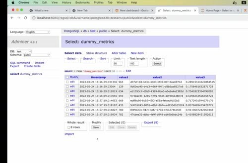

# Dummy Monitoring

Before connecting real model metrics, test the storage and dashboard path with synthetic values. Dummy monitoring isolates infrastructure problems from model and data problems.

## Create and populate the table

The example creates a PostgreSQL database and a `dummy_metrics` table. Each iteration generates a timestamp, a numeric value, a UUID string, and a random float. It then inserts the row into PostgreSQL.

Connect with `psycopg` and use an explicit table schema. Confirm that the database exists and that the insert works before opening Grafana.

## Check the dashboard loop

Run the script at a fixed interval and look at the rows in the database. Configure Grafana with PostgreSQL as a data source. Build a panel over the timestamp column, then verify that new points appear without a manual refresh.

Once this path works, replace the synthetic values with Evidently results while keeping the database and dashboard connection stable.
