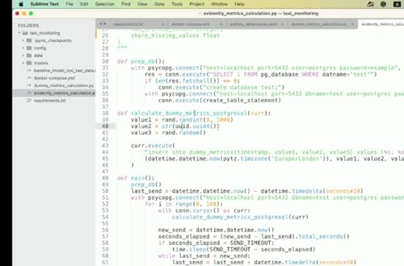
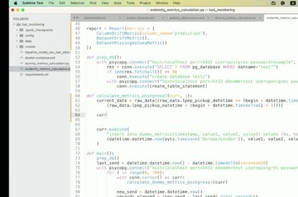
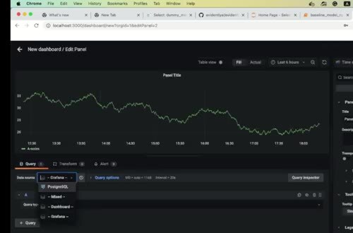

# Data Quality Monitoring

Data-quality checks look for problems that can make predictions unreliable before drift or model-performance metrics explain the cause. Missing values, invalid ranges, and unexpected categories are useful early indicators.

## Extend the report

Use a column mapping that describes the feature types, then add Evidently metrics for missing values, data drift, and prediction drift. The report should compare a known reference dataset with the current batch produced by the monitoring job.

For each batch, follow the same sequence:

- load the reference data and model.
- prepare current features and generate predictions.
- run the report and persist the selected values in the metrics table.

The table is more useful than a screenshot because it supports queries over time.

## Schedule the check

The example uses Prefect to run the metric calculation repeatedly. Prefect is just the scheduling layer here. The monitoring logic should remain callable without it. If you skip Prefect, run the Python function from cron or another orchestrator.

Choose thresholds with the people who own the model. A warning should trigger investigation, while a hard failure should block a downstream process only when the business risk justifies it.
