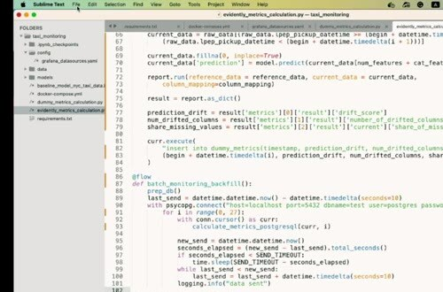
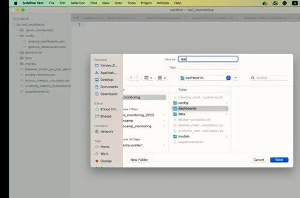
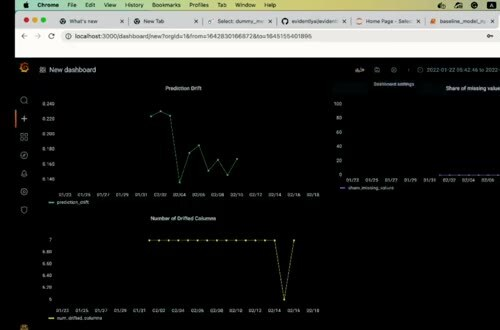

# Save Grafana Dashboard

A dashboard built by hand is easy to lose. Grafana can export the dashboard JSON and load it again through provisioning files when the services start.

## Export and mount the configuration

Create a directory for dashboard definitions and save the JSON exported from Grafana. Configure the Grafana provider to scan that directory, then mount both the provider file and dashboard directory into the container.

The dashboard JSON contains panels and queries, but it shouldn't contain secrets. Keep database credentials in environment variables or a separate secret mechanism.

## Reload and verify

Stop and start the Compose stack, then check that Grafana discovers the dashboard automatically. Verify the data source, the time range, and each panel query after reload.

The saved view should preserve the prediction-drift trend, missing-value share, and number of drifted columns. Treat the JSON as code: review changes and keep it with the monitoring configuration.

