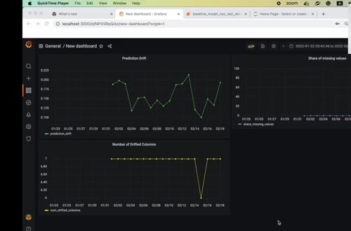
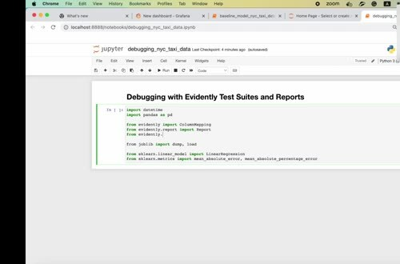
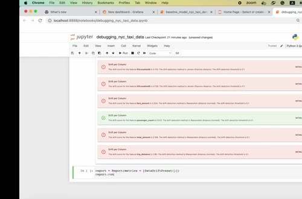

# Debugging with Test Suites and Reports

Monitoring tells us that something changed. Debugging uses reports and test suites to narrow down what changed and whether the difference crosses an agreed threshold.

## Look at the dashboard metric

Start with the metric that triggered the investigation. Prediction drift, the number of drifted columns, and missing-value share can show different problems. Check the time window and compare it with deployments or upstream data changes.

## Run a test suite

Evidently test suites turn expectations into pass or fail results. A data-drift preset can check several columns, while individual tests can focus on a known risk. Run the suite with the same reference and current data used by the monitoring job.

The report gives more detail than a single time-series point. Use it to identify which column or distribution failed, then check the raw batch and the feature-preparation code.

Keep the test thresholds versioned. A threshold change is a monitoring-policy change and should be reviewable alongside model or data-pipeline changes.
