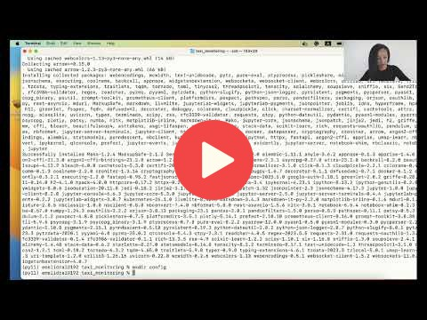

# 5. Model Monitoring

## 5.1 Intro to ML monitoring

<a href="https://www.youtube.com/watch?v=SQ0jBwd_3kk&list=PL3MmuxUbc_hIUISrluw_A7wDSmfOhErJK">
  
</a>


## 5.2 Environment setup

<a href="https://www.youtube.com/watch?v=yixA3C1xSxc&list=PL3MmuxUbc_hIUISrluw_A7wDSmfOhErJK">
  
</a>


## 5.3 Prepare reference and model

<a href="https://www.youtube.com/watch?v=IjNrkqMYQeQ&list=PL3MmuxUbc_hIUISrluw_A7wDSmfOhErJK">
  
</a>


## 5.4 Evidently metrics calculation

<a href="https://www.youtube.com/watch?v=kP3lzh_HfWY&list=PL3MmuxUbc_hIUISrluw_A7wDSmfOhErJK">
  
</a>


## 5.5 Dummy monitoring

<a href="https://www.youtube.com/watch?v=s3G4PMsOMOA&list=PL3MmuxUbc_hIUISrluw_A7wDSmfOhErJK">
  
</a>


## 5.6 Data quality monitoring

<a href="https://www.youtube.com/watch?v=fytrmPbcLhI&list=PL3MmuxUbc_hIUISrluw_A7wDSmfOhErJK">
  
</a>


## 5.7 Save Grafana Dashboard

<a href="https://www.youtube.com/watch?v=-c4iumyZMyw&list=PL3MmuxUbc_hIUISrluw_A7wDSmfOhErJK">
  
</a>


## 5.8 Debugging with test suites and reports

<a href="https://www.youtube.com/watch?v=sNSk3ojISh8&list=PL3MmuxUbc_hIUISrluw_A7wDSmfOhErJK">
  
</a>


## 5.8 Homework


More information [here](../cohorts/2023/05-monitoring/homework.md)


## Notes

Did you take notes? Add them here:

* [Week 5 notes by M. Ayoub C.](https://gist.github.com/Qfl3x/aa6b1bec35fb645ded0371c46e8aafd1)
* [week 5: Monitoring notes Ayoub.B](https://github.com/ayoub-berdeddouch/mlops-journey/blob/main/monitoring-05.md)
* [Week 5: 2023](https://github.com/dimzachar/mlops-zoomcamp/tree/master/notes/Week_5)
* Send a PR, add your notes above this line


# Monitoring example

## Prerequisites

You need following tools installed:
- `docker`
- `docker-compose` (included to Docker Desktop for Mac and Docker Desktop for Windows )

## Preparation

Note: all actions expected to be executed in repo folder.

- Create virtual environment and activate it (eg. `python -m venv venv && source ./venv/bin/activate` or `conda create -n venv python=3.11 && conda activate venv`)
- Install required packages `pip install -r requirements.txt`
- Run `baseline_model_nyc_taxi_data.ipynb` for downloading datasets, training model and creating reference dataset 

## Monitoring Example

### Starting services

To start all required services, execute:
```bash
docker-compose up
```

It will start following services:
- `db` - PostgreSQL, for storing metrics data
- `adminer` - database management tool
- `grafana` - Visual dashboarding tool 


### Sending data

To calculate evidently metrics with prefect and send them to database, execute:
```bash
python evidently_metrics_calculation.py
```

This script will simulate batch monitoring. Every 10 seconds it will collect data for a daily batch, calculate metrics and insert them into database. This metrics will be available in Grafana in preconfigured dashboard. 

### Accsess dashboard

- In your browser go to a `localhost:3000`
The default username and password are `admin`

- Then navigate to `General/Home` menu and click on `Home`.

- In the folder `General` you will see `New Dashboard`. Click on it to access preconfigured dashboard.

### Ad-hoc debugging

Run `debugging_nyc_taxi_data.ipynb` to see how you can perform a debugging with help of Evidently `TestSuites` and `Reports`

### Stopping services

To stop all services, execute:
```bash
docker-compose down
```
