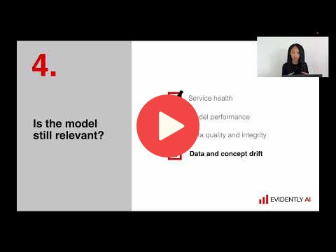
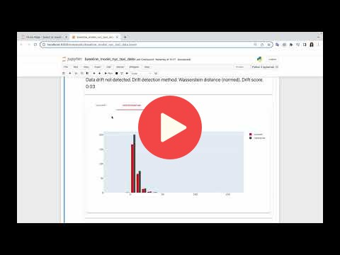
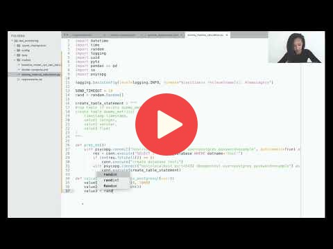

# 5. Model Monitoring

# 5. Model Monitoring

## 5.1 Intro to ML monitoring

<a href="https://www.youtube.com/watch?v=IjNrkqMYQeQ&list=PL3MmuxUbc_hIUISrluw_A7wDSmfOhErJK">
  
</a>


## 5.2 Environment setup

<a href="https://www.youtube.com/watch?v=fytrmPbcLhI&list=PL3MmuxUbc_hIUISrluw_A7wDSmfOhErJK">
  
</a>


## 5.3 Prepare reference and model

<a href="https://www.youtube.com/watch?v=kP3lzh_HfWY&list=PL3MmuxUbc_hIUISrluw_A7wDSmfOhErJK">
  
</a>


## 5.4 Evidently metrics calculation

<a href="https://www.youtube.com/watch?v=-c4iumyZMyw&list=PL3MmuxUbc_hIUISrluw_A7wDSmfOhErJK">
  
</a>


## 5.5 Dummy monitoring

<a href="https://www.youtube.com/watch?v=SQ0jBwd_3kk&list=PL3MmuxUbc_hIUISrluw_A7wDSmfOhErJK">
  
</a>


## 5.6 Save Grafana Dashboard

<a href="https://www.youtube.com/watch?v=s3G4PMsOMOA&list=PL3MmuxUbc_hIUISrluw_A7wDSmfOhErJK">
  
</a>


## 5.7 Debugging with test suites and reports

<a href="https://www.youtube.com/watch?v=sNSk3ojISh&list=PL3MmuxUbc_hIUISrluw_A7wDSmfOhErJK">
  
</a>


## 5.8 Homework


More information here: TBD


## Notes

Did you take notes? Add them here:

* [Week 5 notes by M. Ayoub C.](https://gist.github.com/Qfl3x/aa6b1bec35fb645ded0371c46e8aafd1)
* [week 5: Monitoring notes Ayoub.B](https://github.com/ayoub-berdeddouch/mlops-journey/blob/main/monitoring-05.md)
* Send a PR, add your notes above this line


# Monitoring example

## Prerequisites

You need following tools installed:
- `docker`
- `docker-compose` (included to Docker Desktop for Mac and Docker Desktop for Windows )

## Preparation

Note: all actions expected to be executed in repo folder.

- Create virtual environment and activate it (eg. `python -m venv venv && source ./venv/bin/activate`)
- Install required packages `pip install -r requirements.txt`
- Run `python prepare.py` for downloading datasets

## Monitoring Example

### Starting services

To start all required services, execute:
```bash
docker-compose up
```

It will start following services:
- `prometheus` - TSDB for metrics
- `grafana` - Visual tool for metrics
- `mongo` - MongoDB, for storing raw data, predictions, targets and profile reports
- `evidently_service` - Evindently RT-monitoring service (draft example)
- `prediction_service` - main service, which makes predictions

### Sending data

To start sending data to service, execute:
```bash
python send_data.py
```

This script will send every second single row from dataset to prediction service along with creating file `target.csv` with actual results (so it can be loaded after)

## Batch Monitoring Example

After you stop sending data to service, you can run batch monitoring pipeline (using Prefect) by running script:

```bash
python prefect_example.py
```

This script will:
- load `target.csv` to MongoDB
- download dataset from MongoDB
- Run Evidently Model Profile and Evidently Report on this data
- Save Profile data back to MongoDB
- Save Report to `evidently_report_example.html`

You can look at Prefect steps in Prefect Orion UI
(to start it execute `prefect orion start`)
