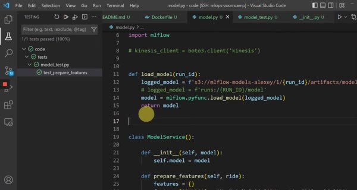

# Testing Python Code with pytest

The best-practices section starts with the streaming model service from Module 4. The first step is to make its behavior testable without deploying the entire cloud architecture.

## Separate logic from infrastructure

Keep feature preparation and model loading in ordinary Python methods. The service can then be tested with a small input record and a known model artifact. Calls to Kinesis or another cloud client should stay at the integration boundary.

The example tests the feature-preparation function and the model-service behavior with pytest. A test should make its expected input and output explicit, so a failure identifies the behavior that changed.

Run `pytest tests/` locally so unit tests can run on every change without AWS credentials or a network connection.
