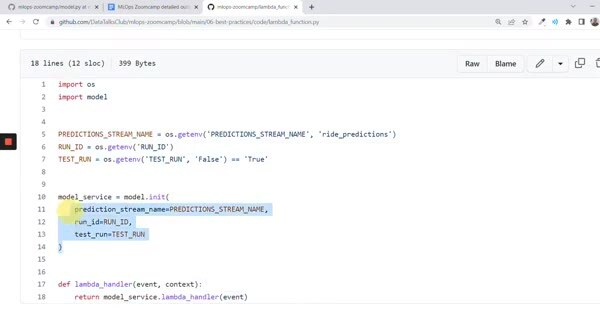
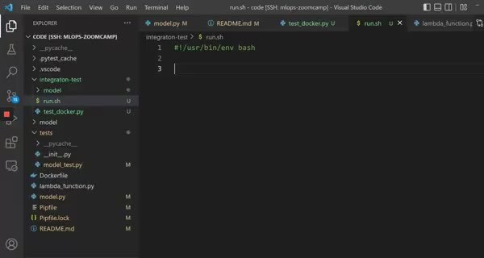

# Integration Tests with docker-compose

Unit tests check Python functions in isolation. An integration test starts the service in Docker, sends an HTTP request, and verifies the response across the actual process boundary.

## Start the service under test

The Compose file supplies the container and its environment. The test client sends a representative event to the running service and compares the returned prediction with the expected value.

Keep the test data deterministic. A small checked-in event fixture makes failures reproducible and avoids coupling the test to a live stream or database.

Use the same image that will run in the target environment. A passing unit test doesn't prove that the image starts, its dependencies are installed, or its HTTP API works.
