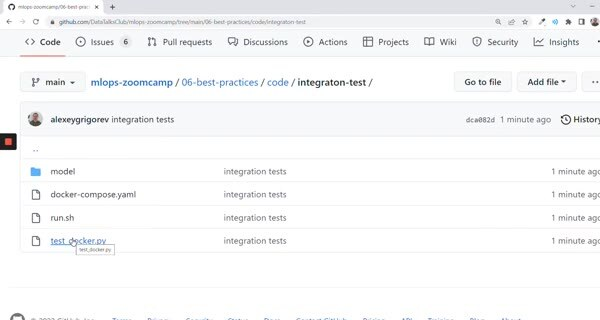
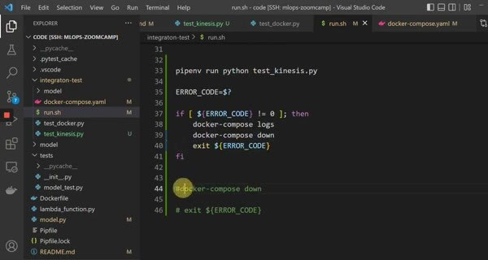

# Testing Cloud Services with LocalStack

Real cloud resources are slow, costly, and harder to reset between tests. LocalStack provides local AWS-compatible endpoints so the Kinesis part of the service can be exercised without sending events to a real AWS account.

## Point the client at LocalStack

Use the endpoint URL `http://localhost:4566` and create a test stream before sending records. The AWS CLI and the Python client can use the same endpoint when the test environment supplies the required dummy credentials.

The test should create the stream, publish a known event, invoke or observe the consumer, and assert the prediction output. Keep cloud-specific setup in fixtures so the test remains readable.

LocalStack is a substitute for the cloud API, not proof that every AWS permission or managed-service behavior is correct. Keep a small real-cloud smoke test for the deployment environment when that risk matters.
