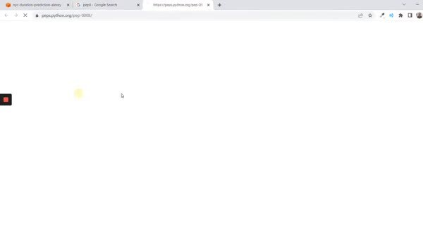
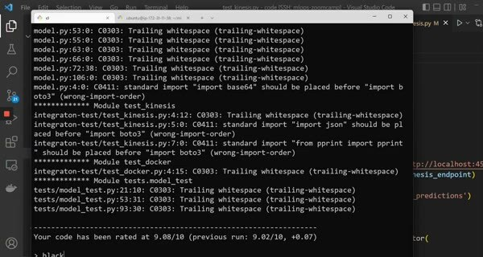

# Code Quality: Linting and Formatting

Tests check behavior, while formatting and linting make the code easier to read and catch mistakes before a test or review.

## Use focused tools

`isort` orders imports and `black` formats Python consistently, while `pylint` checks code quality and reports suspicious patterns such as unused imports or unreachable code. Configure the tools in `pyproject.toml` so local and CI runs use the same rules.

Run the tools on the repository and fix their output instead of hiding warnings. A clean check is more useful when the configuration explains which warnings are intentional.

