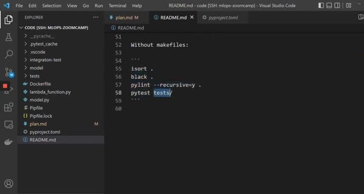
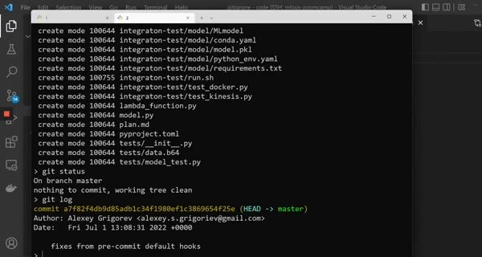

# Git Pre-commit Hooks

Pre-commit hooks run quality checks before Git creates a commit. They give the author fast feedback and prevent avoidable formatting or test failures from reaching the shared branch.

## Configure the hooks

The example configures these hooks:

- whitespace checks and YAML validation.
- large-file checks and import sorting.
- Black, Pylint, and pytest.

Keep the configuration in the repository so every contributor can install the same hooks.

Install the hooks with `pre-commit install`, then run all hooks once with `pre-commit run --all-files`. A commit should fail when a hook finds a problem, giving the author a chance to fix it before the commit is created.

Hooks are a local safety net, not a replacement for CI. Run the same checks in the CI workflow so a contributor who skipped local hooks can't bypass the project's quality gate.
