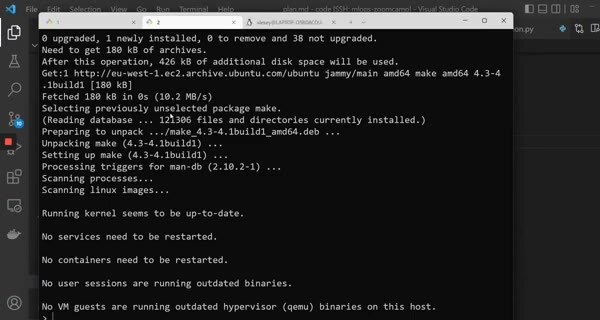
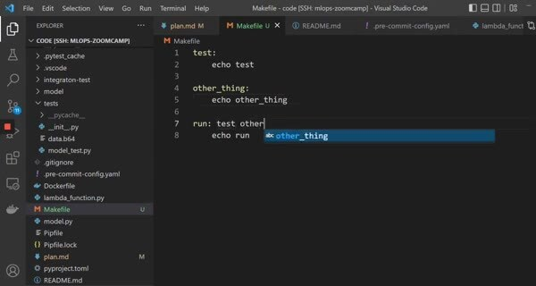

# Makefiles and make

The project has separate commands for tests and quality checks. It also has commands for image builds, integration tests, and setup. A Makefile gives each command a stable, discoverable name.

## Targets and dependencies

The example defines these targets:

- `test` and `quality_checks`
- `build` and `integration_test`
- `publish` and `setup`

A target can depend on another target, so `build` runs quality checks and tests before building the Docker image.

Run `make test` or `make quality_checks` while developing, and use `make build` when you want the same prerequisites before creating the image.

Keep target names and environment variables documented. A short command should still make it clear which external services, credentials, or Docker resources it needs.
