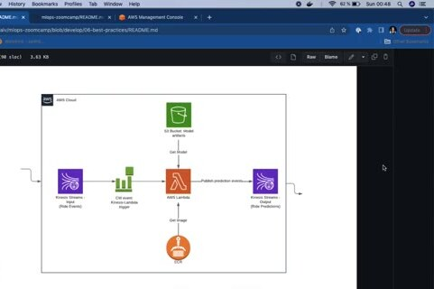

# Terraform: Introduction

Infrastructure as code describes cloud resources in version-controlled files. Terraform turns those declarations into a plan that can be reviewed before it changes AWS.

## Model the stream pipeline

The example provisions the infrastructure for the stream-based ride-prediction service:

- Kinesis streams for input and output.
- A Lambda serving function.
- An S3 bucket for model artifacts.
- An ECR repository for the image.

Terraform uses a provider to talk to AWS, resources to describe objects, variables for environment-specific values, and state to remember what it manages.

Initialize the project with `terraform init`, review `terraform plan`, and apply only after checking the proposed changes. Destroy temporary infrastructure when the exercise is complete because the AWS resources can incur charges.
